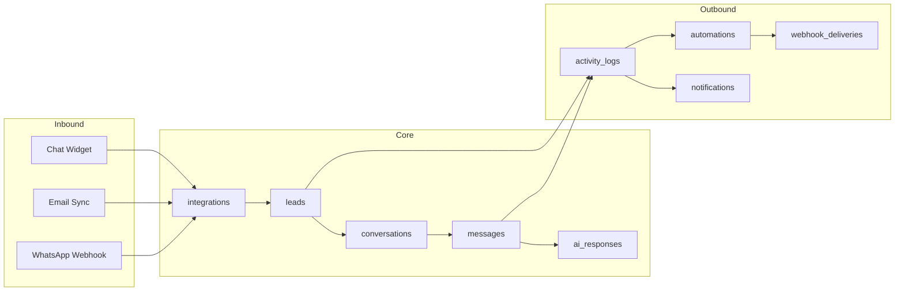
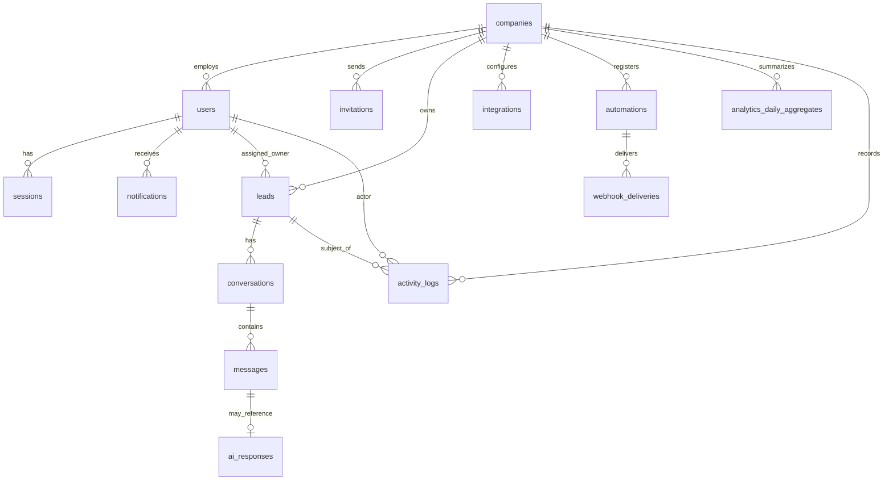

# Project Atlas AI — MongoDB Database Architecture

| Document Control | |
|---|---|
| **Product** | Project Atlas AI |
| **Document type** | Database Architecture (MVP) |
| **Database** | MongoDB 7.x (Atlas recommended) |
| **Version** | 1.0 |
| **Status** | Draft for engineering review |
| **Audience** | Backend, Platform, Security, Data |
| **Related** | `docs/MVP_SPECIFICATION.md` |
| **Last updated** | 14 July 2026 |

---

## Table of Contents

1. [Architecture Overview](#1-architecture-overview)
2. [Design Principles](#2-design-principles)
3. [Collection Catalog](#3-collection-catalog)
4. [Entity Relationship Model](#4-entity-relationship-model)
5. [Shared Conventions](#5-shared-conventions)
6. [Core Collections](#6-core-collections)
7. [Supporting Collections](#7-supporting-collections)
8. [Cross-Cutting Concerns](#8-cross-cutting-concerns)
9. [Index Strategy Summary](#9-index-strategy-summary)
10. [Schema Validation Deployment](#10-schema-validation-deployment)
11. [Data Lifecycle & Retention](#11-data-lifecycle--retention)
12. [Security & Compliance Notes](#12-security--compliance-notes)

---

## 1. Architecture Overview

Project Atlas AI is a **multi-tenant SaaS** where **Company** is the tenant boundary. Every business record (leads, conversations, messages, integrations, etc.) is scoped by `companyId`. Users belong to exactly one company in MVP (multi-company membership is post-MVP).

### High-Level Data Flow



### Database Topology (MVP)

| Layer | Recommendation |
|---|---|
| **Primary** | MongoDB Atlas M10+ (replica set, 3 nodes) |
| **Application DB** | Single database: `atlas_prod` (per environment) |
| **Caching** | Redis for sessions/rate limits (not persisted in Mongo) |
| **Search** | MongoDB text + compound indexes; Atlas Search optional stretch |
| **Secrets** | Integration OAuth tokens encrypted at application layer; optional Atlas CSFLE for highly sensitive fields |

---

## 2. Design Principles

1. **Tenant isolation first** — Every query on tenant data MUST include `companyId`. Enforce via compound indexes leading with `companyId` and application middleware.
2. **Idempotent ingestion** — External channel events use provider-native IDs stored on `messages` / `integrations` to prevent duplicates (NFR-R02).
3. **Append-heavy messaging** — Messages and activity logs are write-heavy; optimize for time-ordered reads, not in-place mutation.
4. **Denormalize for inbox performance** — `leads` and `conversations` carry summary fields (`lastMessageAt`, `unreadCount`) updated atomically on message insert.
5. **Separate secrets from config** — `integrations.credentials` holds encrypted blobs; non-sensitive config remains queryable.
6. **Human-in-the-loop AI** — `ai_responses` are distinct from `messages`; a sent AI-assisted reply creates a `messages` record referencing `aiResponseId`.
7. **Automation as events** — `automations` define outbound webhooks; `webhook_deliveries` stores delivery attempts (high volume, TTL-friendly).
8. **Soft delete where users expect recovery** — Leads use `status: archived`; users use `status: deactivated`.

---

## 3. Collection Catalog

### Core Collections (Required MVP)

| Collection | Purpose |
|---|---|
| `companies` | Tenant root: org profile, pipeline, AI settings, billing placeholder |
| `users` | Authenticated workspace members, roles, preferences |
| `leads` | CRM records: contact identity, pipeline stage, ownership, tags |
| `conversations` | Channel-scoped threads tied to a lead (inbox unit) |
| `messages` | Inbound/outbound message bodies and delivery state |
| `ai_responses` | AI-generated drafts, acceptance metrics, model metadata |
| `integrations` | WhatsApp, email, chat widget connections and health |
| `automations` | Webhook endpoints, event subscriptions, signing secrets |
| `notifications` | In-app (and optional email) user notifications |
| `activity_logs` | Unified audit trail + lead timeline events |

### Supporting Collections (Required for Production MVP)

| Collection | Purpose |
|---|---|
| `invitations` | Pending team invites (AUTH-04) |
| `sessions` | Refresh token sessions (AUTH-02) |
| `password_reset_tokens` | Short-lived reset tokens (AUTH-03) |
| `webhook_deliveries` | Outbound automation delivery log (N8N-06) |
| `idempotency_keys` | Inbound webhook deduplication (NFR-R02) |
| `analytics_daily_aggregates` | Pre-computed KPI rollups for dashboard/analytics |

> **Note:** Pipeline stages are embedded in `companies.pipeline.stages` for MVP—not a separate collection.

---

## 4. Entity Relationship Model



### Cardinality Rules

| Relationship | Rule |
|---|---|
| Company → User | 1:N; MVP: user belongs to one company |
| Lead → Conversation | 1:N; typically one conversation per `(lead, channel)` |
| Conversation → Message | 1:N; ordered by `createdAt` |
| Message → AI Response | N:1 optional; outbound AI-assisted messages link `aiResponseId` |
| Lead → Activity Log | 1:N; polymorphic `entity` reference |
| Automation → Webhook Delivery | 1:N; retained with TTL |

---

## 5. Shared Conventions

### Identifiers

| Field | Type | Notes |
|---|---|---|
| `_id` | `ObjectId` | MongoDB default primary key |
| `companyId` | `ObjectId` | FK → `companies._id`; **required on all tenant data** |
| `*Id` suffix | `ObjectId` | Foreign key references |

### Timestamps

| Field | Type | Notes |
|---|---|---|
| `createdAt` | `Date` | UTC, set on insert |
| `updatedAt` | `Date` | UTC, set on every update |
| `deletedAt` | `Date` | Optional; soft-delete marker |

### Common Enums (stored as `string`)

```
UserRole:       owner | admin | agent | viewer
UserStatus:     active | deactivated | pending_verification
CompanyStatus:  active | suspended | trial | churned
LeadStatus:     active | archived | merged
Channel:        whatsapp | email | chat | manual | import
MessageDirection: inbound | outbound
MessageStatus:  pending | sent | delivered | read | failed
IntegrationType: whatsapp | email | chat_widget
IntegrationStatus: connected | disconnected | error | pending
AutomationStatus: enabled | disabled
NotificationType: new_lead | assignment | message_received | integration_error | webhook_failure | system
ActivityType:   lead_created | lead_updated | stage_changed | note_added | message_received | message_sent | assignment_changed | integration_connected | integration_error | ai_draft_generated | ai_draft_sent | user_invited | settings_changed
```

### Phone & Email Normalization

- `email`: lowercase, trimmed; store `emailNormalized`
- `phone`: E.164 format in `phoneNormalized` (e.g. `+2348012345678`)
- Duplicate detection indexes use normalized fields

---

## 6. Core Collections

---

### 6.1 `companies`

**Purpose:** Root tenant record. Stores organization profile, default locale, embedded pipeline configuration, AI workspace settings, notification defaults, and billing placeholder.

#### Fields

| Field | Data Type | Required | Optional | Description |
|---|---|:---:|:---:|---|
| `_id` | `ObjectId` | ✓ | | Primary key |
| `name` | `string` | ✓ | | Legal or trading name |
| `slug` | `string` | ✓ | | URL-safe unique identifier |
| `status` | `string` (enum) | ✓ | | `active`, `trial`, `suspended`, `churned` |
| `logoUrl` | `string` | | ✓ | CDN URL |
| `timezone` | `string` | ✓ | | IANA timezone (e.g. `Africa/Lagos`) |
| `defaultLanguage` | `string` | ✓ | | BCP-47 (e.g. `en`, `fr`, `pt-BR`) |
| `pipeline` | `object` | ✓ | | Embedded pipeline config (see below) |
| `aiSettings` | `object` | ✓ | | Workspace AI config (see below) |
| `notificationDefaults` | `object` | ✓ | | Org-level notification toggles |
| `billing` | `object` | | ✓ | Plan display / subscription placeholder |
| `onboarding` | `object` | | ✓ | Activation checklist progress |
| `metadata` | `object` | | ✓ | Extensible key-value (non-PII) |
| `createdAt` | `Date` | ✓ | | |
| `updatedAt` | `Date` | ✓ | | |

**`pipeline` object:**

| Sub-field | Data Type | Required | Description |
|---|---|:---:|---|
| `stages` | `array<object>` | ✓ | Ordered stage definitions |
| `stages[].id` | `string` | ✓ | Stable UUID within company |
| `stages[].name` | `string` | ✓ | Display name |
| `stages[].order` | `int` | ✓ | 0-based sort order |
| `stages[].isTerminal` | `bool` | ✓ | `true` for Won/Lost |
| `stages[].color` | `string` | | Hex color for UI |

**`aiSettings` object:**

| Sub-field | Data Type | Required | Description |
|---|---|:---:|---|
| `tone` | `string` | ✓ | e.g. `professional`, `friendly` |
| `doRules` | `array<string>` | | Instructions AI must follow |
| `dontRules` | `array<string>` | | Prohibited behaviors/topics |
| `knowledgeSnippets` | `array<object>` | | FAQ / policy snippets |
| `knowledgeSnippets[].title` | `string` | ✓ | |
| `knowledgeSnippets[].content` | `string` | ✓ | |
| `defaultLanguage` | `string` | | Override for AI replies |
| `humanInTheLoop` | `bool` | ✓ | Default `true` for MVP |

**`billing` object (optional MVP):**

| Sub-field | Data Type | Description |
|---|---|---|
| `planId` | `string` | `trial`, `starter`, `growth` |
| `seatLimit` | `int` | Licensed seats |
| `aiReplyLimit` | `int` | Monthly AI draft quota |
| `trialEndsAt` | `Date` | |

#### Relationships

| To | Type | Field |
|---|---|---|
| `users` | 1:N | `users.companyId` |
| `leads` | 1:N | `leads.companyId` |
| `integrations` | 1:N | `integrations.companyId` |
| `automations` | 1:N | `automations.companyId` |

#### Indexes

| Name | Keys | Options | Purpose |
|---|---|---|---|
| `uniq_slug` | `{ slug: 1 }` | unique | Tenant routing |
| `status_created` | `{ status: 1, createdAt: -1 }` | | Admin queries |

#### Validation Rules

```javascript
{
  $jsonSchema: {
    bsonType: "object",
    required: ["name", "slug", "status", "timezone", "defaultLanguage", "pipeline", "aiSettings", "createdAt", "updatedAt"],
    properties: {
      name: { bsonType: "string", minLength: 1, maxLength: 200 },
      slug: { bsonType: "string", pattern: "^[a-z0-9-]{3,50}$" },
      status: { enum: ["active", "trial", "suspended", "churned"] },
      timezone: { bsonType: "string", minLength: 1 },
      defaultLanguage: { bsonType: "string", minLength: 2, maxLength: 10 },
      pipeline: {
        bsonType: "object",
        required: ["stages"],
        properties: {
          stages: {
            bsonType: "array",
            minItems: 2,
            maxItems: 20,
            items: {
              bsonType: "object",
              required: ["id", "name", "order", "isTerminal"],
              properties: {
                id: { bsonType: "string" },
                name: { bsonType: "string", minLength: 1, maxLength: 50 },
                order: { bsonType: "int", minimum: 0 },
                isTerminal: { bsonType: "bool" }
              }
            }
          }
        }
      },
      aiSettings: {
        bsonType: "object",
        required: ["tone", "humanInTheLoop"],
        properties: {
          tone: { bsonType: "string" },
          humanInTheLoop: { bsonType: "bool" }
        }
      }
    }
  }
}
```

---

### 6.2 `users`

**Purpose:** Workspace members with authentication credentials, role-based access, profile, per-user notification preferences, and activity stamps.

#### Fields

| Field | Data Type | Required | Optional | Description |
|---|---|:---:|:---:|---|
| `_id` | `ObjectId` | ✓ | | Primary key |
| `companyId` | `ObjectId` | ✓ | | Tenant FK |
| `email` | `string` | ✓ | | Login email |
| `emailNormalized` | `string` | ✓ | | Lowercase email for uniqueness |
| `passwordHash` | `string` | ✓ | | bcrypt/argon2 hash; never returned to client |
| `firstName` | `string` | ✓ | | |
| `lastName` | `string` | ✓ | | |
| `avatarUrl` | `string` | | ✓ | |
| `role` | `string` (enum) | ✓ | | `owner`, `admin`, `agent`, `viewer` |
| `status` | `string` (enum) | ✓ | | `active`, `deactivated`, `pending_verification` |
| `emailVerifiedAt` | `Date` | | ✓ | |
| `lastLoginAt` | `Date` | | ✓ | SET-09 audit-lite |
| `notificationPreferences` | `object` | ✓ | | Per-user overrides |
| `createdAt` | `Date` | ✓ | | |
| `updatedAt` | `Date` | ✓ | | |
| `deactivatedAt` | `Date` | | ✓ | |

**`notificationPreferences` object:**

| Sub-field | Data Type | Default |
|---|---|---|
| `inApp.newLead` | `bool` | `true` |
| `inApp.assignment` | `bool` | `true` |
| `inApp.messageReceived` | `bool` | `true` |
| `inApp.integrationError` | `bool` | `true` (admin only) |
| `email.newLead` | `bool` | `false` |
| `email.assignment` | `bool` | `true` |
| `email.digest` | `bool` | `false` |

#### Relationships

| To | Type | Field |
|---|---|---|
| `companies` | N:1 | `companyId` → `companies._id` |
| `leads` | 1:N | `leads.ownerId` |
| `sessions` | 1:N | `sessions.userId` |
| `notifications` | 1:N | `notifications.userId` |
| `activity_logs` | 1:N | `activity_logs.actor.userId` |

#### Indexes

| Name | Keys | Options | Purpose |
|---|---|---|---|
| `uniq_company_email` | `{ companyId: 1, emailNormalized: 1 }` | unique | Tenant-scoped login |
| `company_status_role` | `{ companyId: 1, status: 1, role: 1 }` | | Team management |
| `company_last_login` | `{ companyId: 1, lastLoginAt: -1 }` | | Admin audit |

#### Validation Rules

- `email` must be valid email format (application + regex `^[^\s@]+@[^\s@]+\.[^\s@]+$`)
- `role` ∈ `{ owner, admin, agent, viewer }`
- `status` ∈ `{ active, deactivated, pending_verification }`
- Exactly one `owner` per company enforced at application layer
- `passwordHash` min length 60 (bcrypt) — never log or expose

---

### 6.3 `leads`

**Purpose:** CRM entity representing a prospect/customer. Central identity resolution point for email/phone matching across channels.

#### Fields

| Field | Data Type | Required | Optional | Description |
|---|---|:---:|:---:|---|
| `_id` | `ObjectId` | ✓ | | Primary key |
| `companyId` | `ObjectId` | ✓ | | Tenant FK |
| `status` | `string` (enum) | ✓ | | `active`, `archived`, `merged` |
| `firstName` | `string` | | ✓ | At least one of firstName/lastName/displayName required |
| `lastName` | `string` | | ✓ | |
| `displayName` | `string` | | ✓ | Fallback display |
| `email` | `string` | | ✓ | |
| `emailNormalized` | `string` | | ✓ | Lowercase |
| `phone` | `string` | | ✓ | Display format |
| `phoneNormalized` | `string` | | ✓ | E.164 |
| `companyName` | `string` | | ✓ | Lead's organization |
| `source` | `string` | ✓ | | `website`, `whatsapp`, `email`, `chat`, `referral`, `import`, `manual`, `other` |
| `sourceDetail` | `string` | | ✓ | UTM, campaign, referrer |
| `stageId` | `string` | ✓ | | References `companies.pipeline.stages[].id` |
| `ownerId` | `ObjectId` | | ✓ | FK → `users._id` |
| `tags` | `array<string>` | | ✓ | Max 20 tags |
| `channels` | `array<string>` | ✓ | | Channels seen: `whatsapp`, `email`, `chat` |
| `primaryChannel` | `string` | | ✓ | Most recent inbound channel |
| `firstContactedAt` | `Date` | | ✓ | First outbound reply timestamp |
| `firstResponseTimeMs` | `long` | | ✓ | Computed: first outbound − first inbound |
| `lastMessageAt` | `Date` | | ✓ | Denormalized inbox sort |
| `lastInboundAt` | `Date` | | ✓ | |
| `lastOutboundAt` | `Date` | | ✓ | |
| `unreadCount` | `int` | ✓ | | Default `0` |
| `openConversationCount` | `int` | ✓ | | Default `0` |
| `mergedIntoLeadId` | `ObjectId` | | ✓ | If `status=merged` |
| `externalIds` | `object` | | ✓ | Provider IDs map |
| `customFields` | `object` | | ✓ | Limited flat key-value |
| `createdAt` | `Date` | ✓ | | |
| `updatedAt` | `Date` | ✓ | | |
| `archivedAt` | `Date` | | ✓ | |

#### Relationships

| To | Type | Field |
|---|---|---|
| `companies` | N:1 | `companyId` |
| `users` | N:1 | `ownerId` |
| `conversations` | 1:N | `conversations.leadId` |
| `activity_logs` | 1:N | `activity_logs.entity.leadId` |

#### Indexes

| Name | Keys | Options | Purpose |
|---|---|---|---|
| `company_status_updated` | `{ companyId: 1, status: 1, lastMessageAt: -1 }` | | Inbox default sort |
| `company_stage` | `{ companyId: 1, stageId: 1, createdAt: -1 }` | | Pipeline views |
| `company_owner` | `{ companyId: 1, ownerId: 1, status: 1 }` | | Agent workload |
| `company_source` | `{ companyId: 1, source: 1, createdAt: -1 }` | | Analytics |
| `dup_email` | `{ companyId: 1, emailNormalized: 1 }` | sparse | Duplicate detection |
| `dup_phone` | `{ companyId: 1, phoneNormalized: 1 }` | sparse | Duplicate detection |
| `company_created` | `{ companyId: 1, createdAt: -1 }` | | Date-range reports |
| `text_search` | `{ firstName: "text", lastName: "text", email: "text", companyName: "text", displayName: "text" }` | | Full-text search |

#### Validation Rules

- At least one identifier: `emailNormalized` OR `phoneNormalized` OR (`firstName` + `lastName`) OR `displayName`
- `source` must be valid enum
- `stageId` must exist in parent company's `pipeline.stages` (application validation)
- `unreadCount` ≥ 0
- `tags` max 20 items, each max 50 chars
- `status=merged` requires `mergedIntoLeadId`

---

### 6.4 `conversations`

**Purpose:** Channel-scoped message thread belonging to a lead. Inbox UI loads conversations; lead detail aggregates all conversations.

#### Fields

| Field | Data Type | Required | Optional | Description |
|---|---|:---:|:---:|---|
| `_id` | `ObjectId` | ✓ | | Primary key |
| `companyId` | `ObjectId` | ✓ | | Tenant FK |
| `leadId` | `ObjectId` | ✓ | | FK → `leads._id` |
| `integrationId` | `ObjectId` | | ✓ | FK → `integrations._id` |
| `channel` | `string` (enum) | ✓ | | `whatsapp`, `email`, `chat` |
| `status` | `string` | ✓ | | `open`, `closed`, `snoozed` |
| `subject` | `string` | | ✓ | Email subject |
| `externalThreadId` | `string` | | ✓ | Provider thread/conversation ID |
| `participantAddress` | `string` | | ✓ | WhatsApp number or email address |
| `lastMessageAt` | `Date` | ✓ | | Denormalized |
| `lastMessagePreview` | `string` | | ✓ | Truncated snippet (max 200 chars) |
| `lastMessageDirection` | `string` | | ✓ | `inbound` / `outbound` |
| `unreadCount` | `int` | ✓ | | Per-conversation unread |
| `assignedToId` | `ObjectId` | | ✓ | Optional conversation-level assignee |
| `snoozedUntil` | `Date` | | ✓ | |
| `metadata` | `object` | | ✓ | Channel-specific (e.g. WhatsApp window expiry) |
| `createdAt` | `Date` | ✓ | | |
| `updatedAt` | `Date` | ✓ | | |

#### Relationships

| To | Type | Field |
|---|---|---|
| `leads` | N:1 | `leadId` |
| `integrations` | N:1 | `integrationId` |
| `messages` | 1:N | `messages.conversationId` |

#### Indexes

| Name | Keys | Options | Purpose |
|---|---|---|---|
| `company_lead_channel` | `{ companyId: 1, leadId: 1, channel: 1 }` | unique (partial: status≠merged) | One active thread per channel |
| `company_inbox` | `{ companyId: 1, status: 1, lastMessageAt: -1 }` | | Inbox listing |
| `company_unread` | `{ companyId: 1, unreadCount: 1, lastMessageAt: -1 }` | partial: `unreadCount > 0` | Unread filter |
| `external_thread` | `{ companyId: 1, channel: 1, externalThreadId: 1 }` | sparse, unique | Idempotent thread attach |

#### Validation Rules

- `channel` ∈ `{ whatsapp, email, chat }`
- `status` ∈ `{ open, closed, snoozed }`
- `unreadCount` ≥ 0
- `lastMessagePreview` max 200 characters
- `snoozed` status requires `snoozedUntil`

---

### 6.5 `messages`

**Purpose:** Immutable message records for all channels. Supports delivery tracking, attachments metadata, and idempotent inbound ingestion.

#### Fields

| Field | Data Type | Required | Optional | Description |
|---|---|:---:|:---:|---|
| `_id` | `ObjectId` | ✓ | | Primary key |
| `companyId` | `ObjectId` | ✓ | | Tenant FK |
| `conversationId` | `ObjectId` | ✓ | | FK → `conversations._id` |
| `leadId` | `ObjectId` | ✓ | | Denormalized for analytics |
| `channel` | `string` (enum) | ✓ | | |
| `direction` | `string` (enum) | ✓ | | `inbound`, `outbound` |
| `status` | `string` (enum) | ✓ | | `pending`, `sent`, `delivered`, `read`, `failed` |
| `contentType` | `string` | ✓ | | `text`, `html`, `template`, `image`, `document`, `audio` |
| `body` | `string` | ✓ | | Plain text or sanitized HTML |
| `bodyHtml` | `string` | | ✓ | Original HTML (email) |
| `subject` | `string` | | ✓ | Email only |
| `sender` | `object` | ✓ | | `{ type: lead|user|system, userId?, address? }` |
| `recipient` | `object` | | ✓ | `{ address, name? }` |
| `attachments` | `array<object>` | | ✓ | `{ name, mimeType, size, url, externalId }` |
| `externalMessageId` | `string` | | ✓ | Provider message ID (idempotency) |
| `externalStatus` | `string` | | ✓ | Raw provider status |
| `aiResponseId` | `ObjectId` | | ✓ | FK if AI-assisted outbound |
| `isAiAssisted` | `bool` | ✓ | | Default `false` |
| `isFirstInbound` | `bool` | | ✓ | Flags lead's first inbound |
| `isFirstOutbound` | `bool` | | ✓ | Flags lead's first outbound |
| `errorCode` | `string` | | ✓ | On failure |
| `errorMessage` | `string` | | ✓ | |
| `sentAt` | `Date` | | ✓ | |
| `deliveredAt` | `Date` | | ✓ | |
| `readAt` | `Date` | | ✓ | |
| `createdAt` | `Date` | ✓ | | |
| `updatedAt` | `Date` | ✓ | | |

#### Relationships

| To | Type | Field |
|---|---|---|
| `conversations` | N:1 | `conversationId` |
| `leads` | N:1 | `leadId` |
| `ai_responses` | N:1 | `aiResponseId` |
| `users` | N:1 | `sender.userId` (outbound) |

#### Indexes

| Name | Keys | Options | Purpose |
|---|---|---|---|
| `conversation_timeline` | `{ companyId: 1, conversationId: 1, createdAt: 1 }` | | Thread rendering |
| `lead_timeline` | `{ companyId: 1, leadId: 1, createdAt: 1 }` | | Lead activity |
| `idempotent_inbound` | `{ companyId: 1, channel: 1, externalMessageId: 1 }` | unique, sparse | Dedup webhooks |
| `company_channel_created` | `{ companyId: 1, channel: 1, createdAt: -1 }` | | Channel volume analytics |
| `first_response` | `{ companyId: 1, leadId: 1, isFirstOutbound: 1 }` | partial | Response time KPI |
| `ai_assisted` | `{ companyId: 1, isAiAssisted: 1, createdAt: -1 }` | | AI usage analytics |

#### Validation Rules

- `direction` ∈ `{ inbound, outbound }`
- `status` ∈ `{ pending, sent, delivered, read, failed }`
- `body` max 32,000 chars (WhatsApp limit-aware)
- `attachments` max 10 per message; `size` max 16MB per file (configurable)
- Outbound `failed` should have `errorCode` or `errorMessage`
- `externalMessageId` required for inbound channel messages (application rule)
- `isAiAssisted=true` requires `aiResponseId` on outbound

---

### 6.6 `ai_responses`

**Purpose:** Stores AI-generated reply drafts, qualification suggestions, acceptance/edit metrics, and model provenance for analytics and guardrail auditing.

#### Fields

| Field | Data Type | Required | Optional | Description |
|---|---|:---:|:---:|---|
| `_id` | `ObjectId` | ✓ | | Primary key |
| `companyId` | `ObjectId` | ✓ | | Tenant FK |
| `leadId` | `ObjectId` | ✓ | | FK → `leads._id` |
| `conversationId` | `ObjectId` | ✓ | | FK → `conversations._id` |
| `triggerMessageId` | `ObjectId` | | ✓ | Inbound message that prompted draft |
| `status` | `string` (enum) | ✓ | | `generated`, `accepted`, `edited`, `rejected`, `expired`, `failed` |
| `draftBody` | `string` | ✓ | | AI-generated text |
| `finalBody` | `string` | | ✓ | After user edits |
| `sentMessageId` | `ObjectId` | | ✓ | FK → `messages._id` when sent |
| `language` | `string` | ✓ | | Detected/target BCP-47 |
| `qualificationSuggestions` | `array<string>` | | ✓ | Suggested questions |
| `model` | `object` | ✓ | | `{ provider, name, version }` |
| `usage` | `object` | | ✓ | `{ promptTokens, completionTokens, latencyMs }` |
| `guardrailFlags` | `array<string>` | | ✓ | e.g. `missing_pricing_data` |
| `rejectionReason` | `string` | | ✓ | User discard reason |
| `requestedById` | `ObjectId` | ✓ | | FK → `users._id` |
| `acceptedById` | `ObjectId` | | ✓ | FK → `users._id` |
| `promptSnapshot` | `object` | | ✓ | Redacted prompt metadata for debug |
| `createdAt` | `Date` | ✓ | | |
| `updatedAt` | `Date` | ✓ | | |
| `expiresAt` | `Date` | | ✓ | Draft TTL |

#### Relationships

| To | Type | Field |
|---|---|---|
| `leads` | N:1 | `leadId` |
| `conversations` | N:1 | `conversationId` |
| `messages` | 1:1 optional | `sentMessageId`, `triggerMessageId` |
| `users` | N:1 | `requestedById`, `acceptedById` |

#### Indexes

| Name | Keys | Options | Purpose |
|---|---|---|---|
| `company_conversation` | `{ companyId: 1, conversationId: 1, createdAt: -1 }` | | Recent drafts |
| `company_status` | `{ companyId: 1, status: 1, createdAt: -1 }` | | Acceptance rate analytics |
| `company_lead` | `{ companyId: 1, leadId: 1, createdAt: -1 }` | | Lead AI history |
| `ttl_expires` | `{ expiresAt: 1 }` | expireAfterSeconds: 0, sparse | Auto-clean expired drafts |

#### Validation Rules

- `status` ∈ `{ generated, accepted, edited, rejected, expired, failed }`
- `draftBody` min 1 char, max 8,000 chars
- `status` ∈ `{ accepted, edited }` requires `sentMessageId` and `acceptedById`
- `model.provider` and `model.name` required
- `failed` status requires `guardrailFlags` or error in `promptSnapshot`

---

### 6.7 `integrations`

**Purpose:** Channel connection records for WhatsApp, email, and website chat widget. Stores non-secret configuration, encrypted credentials reference, health status, and sync state.

#### Fields

| Field | Data Type | Required | Optional | Description |
|---|---|:---:|:---:|---|
| `_id` | `ObjectId` | ✓ | | Primary key |
| `companyId` | `ObjectId` | ✓ | | Tenant FK |
| `type` | `string` (enum) | ✓ | | `whatsapp`, `email`, `chat_widget` |
| `name` | `string` | ✓ | | User-facing label |
| `status` | `string` (enum) | ✓ | | `connected`, `disconnected`, `error`, `pending` |
| `config` | `object` | ✓ | | Type-specific non-secret config |
| `credentials` | `object` | | ✓ | Encrypted token blob + key version |
| `health` | `object` | ✓ | | Connection health |
| `connectedById` | `ObjectId` | | ✓ | FK → `users._id` |
| `lastSyncAt` | `Date` | | ✓ | |
| `lastErrorAt` | `Date` | | ✓ | |
| `lastErrorMessage` | `string` | | ✓ | User-safe message |
| `createdAt` | `Date` | ✓ | | |
| `updatedAt` | `Date` | ✓ | | |

**`config` by type:**

| Type | Key Fields |
|---|---|
| `whatsapp` | `phoneNumberId`, `businessAccountId`, `displayPhoneNumber`, `webhookVerifyToken` |
| `email` | `provider` (`google`, `microsoft`, `smtp`), `emailAddress`, `syncMailbox`, `smtpHost` |
| `chat_widget` | `widgetId`, `primaryColor`, `greeting`, `launcherPosition`, `offlineMessage`, `allowedDomains[]`, `requireContactBeforeChat` |

**`credentials` object:**

| Sub-field | Data Type | Description |
|---|---|---|
| `ciphertext` | `string` | AES-256-GCM encrypted payload |
| `keyVersion` | `int` | KMS key rotation version |
| `expiresAt` | `Date` | OAuth token expiry |

**`health` object:**

| Sub-field | Data Type | Description |
|---|---|---|
| `status` | `string` | `healthy`, `degraded`, `unhealthy` |
| `lastCheckedAt` | `Date` | |
| `consecutiveFailures` | `int` | |

#### Relationships

| To | Type | Field |
|---|---|---|
| `companies` | N:1 | `companyId` |
| `conversations` | 1:N | `conversations.integrationId` |

#### Indexes

| Name | Keys | Options | Purpose |
|---|---|---|---|
| `company_type` | `{ companyId: 1, type: 1 }` | | Settings UI |
| `company_status` | `{ companyId: 1, status: 1 }` | | Health dashboard |
| `whatsapp_phone` | `{ type: 1, "config.phoneNumberId": 1 }` | unique, partial: type=whatsapp | Webhook routing |
| `widget_id` | `{ type: 1, "config.widgetId": 1 }` | unique, partial: type=chat_widget | Widget auth |

#### Validation Rules

- `type` ∈ `{ whatsapp, email, chat_widget }`
- `status` ∈ `{ connected, disconnected, error, pending }`
- `connected` status requires valid `credentials` (except `chat_widget` which may be keyless)
- `chat_widget.config.allowedDomains` min 1 domain when connected
- Credentials never returned via API to non-admin roles
- Max 1 active `whatsapp` and 1 `chat_widget` per company (application rule); multiple `email` allowed

---

### 6.8 `automations`

**Purpose:** Outbound webhook endpoint registrations for n8n and other automation consumers. Defines subscribed domain events and signing secrets.

#### Fields

| Field | Data Type | Required | Optional | Description |
|---|---|:---:|:---:|---|
| `_id` | `ObjectId` | ✓ | | Primary key |
| `companyId` | `ObjectId` | ✓ | | Tenant FK |
| `name` | `string` | ✓ | | e.g. "n8n Lead Alerts" |
| `description` | `string` | | ✓ | |
| `status` | `string` (enum) | ✓ | | `enabled`, `disabled` |
| `endpointUrl` | `string` | ✓ | | HTTPS webhook URL |
| `subscribedEvents` | `array<string>` | ✓ | | Event type filter |
| `secretHash` | `string` | ✓ | | HMAC signing secret (hashed) |
| `secretPrefix` | `string` | ✓ | | First 8 chars for UI identification |
| `headers` | `object` | | ✓ | Custom static headers |
| `retryPolicy` | `object` | ✓ | | `{ maxAttempts, backoffMs }` |
| `lastTriggeredAt` | `Date` | | ✓ | |
| `lastSuccessAt` | `Date` | | ✓ | |
| `lastFailureAt` | `Date` | | ✓ | |
| `failureCount` | `int` | ✓ | | Rolling failure counter |
| `createdById` | `ObjectId` | ✓ | | FK → `users._id` |
| `createdAt` | `Date` | ✓ | | |
| `updatedAt` | `Date` | ✓ | | |

**`subscribedEvents` allowed values:**

```
lead.created
lead.updated
lead.stage_changed
lead.assigned
message.received
message.sent
conversation.created
integration.error
ai.draft_generated
ai.draft_sent
```

#### Relationships

| To | Type | Field |
|---|---|---|
| `companies` | N:1 | `companyId` |
| `webhook_deliveries` | 1:N | `webhook_deliveries.automationId` |

#### Indexes

| Name | Keys | Options | Purpose |
|---|---|---|---|
| `company_status` | `{ companyId: 1, status: 1 }` | | Settings list |
| `company_events` | `{ companyId: 1, subscribedEvents: 1 }` | | Event dispatcher lookup |

#### Validation Rules

- `endpointUrl` must be HTTPS (application rule)
- `subscribedEvents` min 1, max 20 items
- `retryPolicy.maxAttempts` between 1 and 10
- `secretHash` never exposed after creation (show once pattern)
- Max 10 automations per company (MVP quota)

---

### 6.9 `notifications`

**Purpose:** User-facing in-app notification queue with read state, deep links, and optional email dispatch tracking.

#### Fields

| Field | Data Type | Required | Optional | Description |
|---|---|:---:|:---:|---|
| `_id` | `ObjectId` | ✓ | | Primary key |
| `companyId` | `ObjectId` | ✓ | | Tenant FK |
| `userId` | `ObjectId` | ✓ | | FK → `users._id` |
| `type` | `string` (enum) | ✓ | | See enum list |
| `title` | `string` | ✓ | | |
| `body` | `string` | ✓ | | |
| `isRead` | `bool` | ✓ | | Default `false` |
| `readAt` | `Date` | | ✓ | |
| `priority` | `string` | ✓ | | `low`, `normal`, `high` |
| `actionUrl` | `string` | | ✓ | Deep link path |
| `entity` | `object` | | ✓ | `{ type, leadId?, conversationId?, messageId?, integrationId? }` |
| `channels` | `object` | ✓ | | `{ inApp: true, email: bool, emailSentAt? }` |
| `expiresAt` | `Date` | | ✓ | |
| `createdAt` | `Date` | ✓ | | |

#### Relationships

| To | Type | Field |
|---|---|---|
| `users` | N:1 | `userId` |
| `leads` | N:1 | `entity.leadId` (optional) |

#### Indexes

| Name | Keys | Options | Purpose |
|---|---|---|---|
| `user_inbox` | `{ companyId: 1, userId: 1, isRead: 1, createdAt: -1 }` | | Notification feed |
| `user_unread` | `{ companyId: 1, userId: 1, isRead: 1 }` | partial: `isRead: false` | Unread badge count |
| `ttl_expires` | `{ expiresAt: 1 }` | expireAfterSeconds: 0, sparse | Auto-cleanup |

#### Validation Rules

- `type` ∈ `{ new_lead, assignment, message_received, integration_error, webhook_failure, system }`
- `title` max 200 chars; `body` max 1,000 chars
- `isRead=true` requires `readAt`
- Notifications for `integration_error` only sent to `admin`/`owner` roles (application rule)

---

### 6.10 `activity_logs`

**Purpose:** Immutable event stream powering lead timelines, admin audit-lite, and automation triggers. Polymorphic actor and entity references.

#### Fields

| Field | Data Type | Required | Optional | Description |
|---|---|:---:|:---:|---|
| `_id` | `ObjectId` | ✓ | | Primary key |
| `companyId` | `ObjectId` | ✓ | | Tenant FK |
| `type` | `string` (enum) | ✓ | | Activity type |
| `actor` | `object` | ✓ | | `{ type: user|system|integration|lead, userId?, integrationId?, name? }` |
| `entity` | `object` | ✓ | | Primary subject |
| `entity.type` | `string` | ✓ | | `lead`, `conversation`, `message`, `integration`, `user`, `automation`, `company` |
| `entity.id` | `ObjectId` | | ✓ | Polymorphic ID |
| `entity.leadId` | `ObjectId` | | ✓ | Denormalized for lead timeline |
| `summary` | `string` | ✓ | | Human-readable description |
| `changes` | `array<object>` | | ✓ | `{ field, oldValue, newValue }` |
| `metadata` | `object` | | ✓ | Event-specific payload |
| `ipAddress` | `string` | | ✓ | For security events |
| `userAgent` | `string` | | ✓ | |
| `correlationId` | `string` | | ✓ | Request trace ID |
| `createdAt` | `Date` | ✓ | | Immutable |

**Note:** `activity_logs` is append-only. No `updatedAt`.

#### Relationships

| To | Type | Field |
|---|---|---|
| `companies` | N:1 | `companyId` |
| `leads` | N:1 | `entity.leadId` |
| `users` | N:1 | `actor.userId` |

#### Indexes

| Name | Keys | Options | Purpose |
|---|---|---|---|
| `lead_timeline` | `{ companyId: 1, "entity.leadId": 1, createdAt: -1 }` | | Lead detail timeline |
| `company_type_date` | `{ companyId: 1, type: 1, createdAt: -1 }` | | Filtered audit |
| `company_created` | `{ companyId: 1, createdAt: -1 }` | | Recent activity feed |
| `correlation` | `{ correlationId: 1 }` | sparse | Distributed tracing |
| `security_actor` | `{ companyId: 1, "actor.userId": 1, type: 1, createdAt: -1 }` | | Security audit |

#### Validation Rules

- No updates or deletes (append-only collection)
- `type` must be valid `ActivityType` enum
- `summary` max 500 chars
- `changes` max 20 items per event
- Security events (`user.login_failed`, `settings_changed`) must include `actor.userId` or `ipAddress`

---

## 7. Supporting Collections

---

### 7.1 `invitations`

**Purpose:** Pending team member invitations before account activation.

| Field | Data Type | Required | Optional |
|---|---|:---:|:---:|
| `_id` | `ObjectId` | ✓ | |
| `companyId` | `ObjectId` | ✓ | |
| `email` | `string` | ✓ | |
| `emailNormalized` | `string` | ✓ | |
| `role` | `string` | ✓ | |
| `tokenHash` | `string` | ✓ | |
| `invitedById` | `ObjectId` | ✓ | |
| `status` | `string` | ✓ | `pending`, `accepted`, `expired`, `revoked` |
| `expiresAt` | `Date` | ✓ | |
| `acceptedAt` | `Date` | | ✓ |
| `createdAt` | `Date` | ✓ | |

**Indexes:** `{ companyId: 1, emailNormalized: 1 }` unique partial pending; `{ expiresAt: 1 }` TTL on expired.

---

### 7.2 `sessions`

**Purpose:** Refresh token sessions for secure authentication (AUTH-02).

| Field | Data Type | Required | Optional |
|---|---|:---:|:---:|
| `_id` | `ObjectId` | ✓ | |
| `userId` | `ObjectId` | ✓ | |
| `companyId` | `ObjectId` | ✓ | |
| `refreshTokenHash` | `string` | ✓ | |
| `userAgent` | `string` | | ✓ |
| `ipAddress` | `string` | | ✓ |
| `expiresAt` | `Date` | ✓ | |
| `revokedAt` | `Date` | | ✓ |
| `createdAt` | `Date` | ✓ | |

**Indexes:** `{ refreshTokenHash: 1 }` unique; `{ userId: 1, revokedAt: 1 }`; `{ expiresAt: 1 }` TTL.

---

### 7.3 `password_reset_tokens`

**Purpose:** Short-lived password reset tokens (AUTH-03).

| Field | Data Type | Required | Optional |
|---|---|:---:|:---:|
| `_id` | `ObjectId` | ✓ | |
| `userId` | `ObjectId` | ✓ | |
| `tokenHash` | `string` | ✓ | |
| `expiresAt` | `Date` | ✓ | |
| `usedAt` | `Date` | | ✓ |
| `createdAt` | `Date` | ✓ | |

**Indexes:** `{ tokenHash: 1 }` unique; `{ expiresAt: 1 }` TTL expireAfterSeconds: 0.

---

### 7.4 `webhook_deliveries`

**Purpose:** Delivery attempt log for automation webhooks (N8N-06). High-write; TTL-managed.

| Field | Data Type | Required | Optional |
|---|---|:---:|:---:|
| `_id` | `ObjectId` | ✓ | |
| `companyId` | `ObjectId` | ✓ | |
| `automationId` | `ObjectId` | ✓ | |
| `eventType` | `string` | ✓ | |
| `eventId` | `string` | ✓ | Idempotency key for outbound |
| `payload` | `object` | ✓ | Redacted snapshot |
| `status` | `string` | ✓ | `pending`, `success`, `failed`, `retrying` |
| `attempt` | `int` | ✓ | |
| `httpStatus` | `int` | | ✓ |
| `responseBody` | `string` | | ✓ | Truncated max 2KB |
| `errorMessage` | `string` | | ✓ |
| `durationMs` | `int` | | ✓ |
| `nextRetryAt` | `Date` | | ✓ |
| `createdAt` | `Date` | ✓ | |
| `completedAt` | `Date` | | ✓ |

**Indexes:** `{ automationId: 1, createdAt: -1 }`; `{ companyId: 1, status: 1, createdAt: -1 }`; `{ eventId: 1 }` unique; `{ createdAt: 1 }` TTL 90 days.

---

### 7.5 `idempotency_keys`

**Purpose:** Inbound webhook deduplication across channel providers (NFR-R02).

| Field | Data Type | Required | Optional |
|---|---|:---:|:---:|
| `_id` | `ObjectId` | ✓ | |
| `companyId` | `ObjectId` | ✓ | |
| `source` | `string` | ✓ | `whatsapp`, `email`, `chat` |
| `key` | `string` | ✓ | Provider event ID |
| `resourceType` | `string` | ✓ | `message`, `lead` |
| `resourceId` | `ObjectId` | ✓ | Created resource |
| `createdAt` | `Date` | ✓ | |

**Indexes:** `{ companyId: 1, source: 1, key: 1 }` unique; `{ createdAt: 1 }` TTL 30 days.

---

### 7.6 `analytics_daily_aggregates`

**Purpose:** Pre-computed daily KPIs per company for fast dashboard and analytics queries (AN-01–AN-07).

| Field | Data Type | Required | Optional |
|---|---|:---:|:---:|
| `_id` | `ObjectId` | ✓ | |
| `companyId` | `ObjectId` | ✓ | |
| `date` | `Date` | ✓ | UTC midnight bucket |
| `metrics` | `object` | ✓ | See below |
| `byChannel` | `object` | ✓ | Per-channel breakdown |
| `bySource` | `object` | ✓ | Per-source breakdown |
| `byAgent` | `object` | | ✓ | `userId` → metrics |
| `computedAt` | `Date` | ✓ | |

**`metrics` object:**

| Key | Type | Description |
|---|---|---|
| `leadsCreated` | `int` | |
| `leadsConverted` | `int` | Reached terminal won |
| `messagesInbound` | `int` | |
| `messagesOutbound` | `int` | |
| `avgFirstResponseTimeMs` | `long` | |
| `aiDraftsGenerated` | `int` | |
| `aiDraftsAccepted` | `int` | |
| `openConversations` | `int` | End-of-day snapshot |

**Indexes:** `{ companyId: 1, date: -1 }` unique.

---

## 8. Cross-Cutting Concerns

### 8.1 Multi-Tenancy Enforcement

```javascript
// REQUIRED query pattern — every tenant-scoped read/write
db.leads.find({ companyId: ObjectId("..."), status: "active" })

// FORBIDDEN — never query without companyId (except global admin tooling)
db.leads.find({ status: "active" })
```

- JWT/access token carries `companyId` and `role`
- Mongoose/global middleware injects `companyId` filter
- Integration tests must assert cross-tenant access returns 404/403

### 8.2 Transaction Boundaries

Use MongoDB multi-document transactions for:

| Operation | Collections involved |
|---|---|
| Inbound message ingest | `idempotency_keys`, `leads`, `conversations`, `messages`, `activity_logs`, `notifications` |
| AI draft send | `ai_responses`, `messages`, `conversations`, `leads`, `activity_logs` |
| Lead merge | `leads`, `conversations`, `activity_logs` |
| User invite accept | `invitations`, `users`, `activity_logs` |

### 8.3 Denormalization Maintenance

On `messages` insert, atomically update:

```
conversations.lastMessageAt, lastMessagePreview, lastMessageDirection, unreadCount
leads.lastMessageAt, lastInboundAt|lastOutboundAt, unreadCount, channels, primaryChannel
leads.firstContactedAt + firstResponseTimeMs (if first outbound)
```

### 8.4 Event Emission (Automations)

After successful writes, dispatch events to matching `automations` where `subscribedEvents` contains event type. Write `webhook_deliveries` record per attempt.

### 8.5 Analytics Aggregation

Nightly (or hourly) batch job aggregates from `leads`, `messages`, `ai_responses` into `analytics_daily_aggregates`. Dashboard reads aggregates; drill-down queries source collections.

---

## 9. Index Strategy Summary

| Collection | Estimated MVP Docs/Org/Month | Hot Query Pattern |
|---|---|---|
| `leads` | 50–2,000 | Inbox sort by `lastMessageAt` |
| `messages` | 500–10,000 | Conversation timeline |
| `conversations` | 50–2,000 | Open + unread filters |
| `activity_logs` | 1,000–20,000 | Lead timeline |
| `notifications` | 200–5,000 | User unread feed |
| `webhook_deliveries` | 100–10,000 | TTL archival |

**Index discipline:**

- All compound indexes **lead with `companyId`**
- Use partial indexes for sparse fields (`emailNormalized`, `externalMessageId`)
- Monitor index size; avoid over-indexing `messages` beyond defined set
- Use covered projections where possible for inbox list (`leads` summary fields)

---

## 10. Schema Validation Deployment

Deploy collection validators via migration scripts (e.g. `migrate-mongo`). Example rollout:

```javascript
db.runCommand({
  collMod: "leads",
  validator: { $jsonSchema: { /* see section 6.3 */ } },
  validationLevel: "moderate",  // enforce on inserts + updates
  validationAction: "error"
});
```

| Collection | validationLevel | Notes |
|---|---|---|
| `companies`, `users`, `leads` | `strict` | Core integrity |
| `messages`, `conversations` | `moderate` | High write volume |
| `activity_logs` | `strict` on insert | Append-only |
| `webhook_deliveries`, `idempotency_keys` | `moderate` | Operational |

---

## 11. Data Lifecycle & Retention

| Collection | Retention Policy |
|---|---|
| `messages` | Indefinite (customer data); export on request |
| `activity_logs` | 24 months, then archive to cold storage |
| `webhook_deliveries` | 90 days TTL |
| `idempotency_keys` | 30 days TTL |
| `notifications` | 90 days TTL (unread retained until read + 30d) |
| `ai_responses` (expired drafts) | 30 days TTL via `expiresAt` |
| `sessions` | TTL on `expiresAt` |
| `password_reset_tokens` | TTL on `expiresAt` |
| `leads` (archived) | Indefinite; hard delete on GDPR erasure request |

### GDPR / Erasure

On delete request:

1. Anonymize `leads` PII fields
2. Redact `messages.body` / `messages.bodyHtml`
3. Purge `users` PII if user erasure requested
4. Retain non-PII aggregates in `analytics_daily_aggregates`

---

## 12. Security & Compliance Notes

| Concern | Implementation |
|---|---|
| **Tenant isolation** | `companyId` on all queries; integration tests |
| **Credential storage** | Encrypt `integrations.credentials`; rotate `keyVersion` |
| **Webhook signing** | HMAC-SHA256 with `automations.secretHash`; constant-time compare |
| **PII minimization** | `promptSnapshot` redacted; no raw passwords in `activity_logs` |
| **Least privilege DB user** | App user: readWrite on `atlas_prod` only; no `dbAdmin` |
| **Backup** | Atlas continuous backup; PITR 7+ days |
| **Encryption** | Atlas encryption at rest; TLS in transit |

---

## Appendix A — Sample Documents

### Lead (abbreviated)

```json
{
  "_id": { "$oid": "66a1234567890abcdef00001" },
  "companyId": { "$oid": "66a1234567890abcdef00010" },
  "status": "active",
  "firstName": "Ada",
  "lastName": "Okafor",
  "email": "ada@example.com",
  "emailNormalized": "ada@example.com",
  "phone": "+234 801 234 5678",
  "phoneNormalized": "+2348012345678",
  "source": "whatsapp",
  "stageId": "stage-new-uuid",
  "ownerId": { "$oid": "66a1234567890abcdef00002" },
  "tags": ["hot", "clinic-inquiry"],
  "channels": ["whatsapp"],
  "primaryChannel": "whatsapp",
  "unreadCount": 1,
  "openConversationCount": 1,
  "lastMessageAt": { "$date": "2026-07-14T10:30:00Z" },
  "createdAt": { "$date": "2026-07-14T10:28:00Z" },
  "updatedAt": { "$date": "2026-07-14T10:30:00Z" }
}
```

### Message (inbound WhatsApp)

```json
{
  "_id": { "$oid": "66a1234567890abcdef00020" },
  "companyId": { "$oid": "66a1234567890abcdef00010" },
  "conversationId": { "$oid": "66a1234567890abcdef00015" },
  "leadId": { "$oid": "66a1234567890abcdef00001" },
  "channel": "whatsapp",
  "direction": "inbound",
  "status": "delivered",
  "contentType": "text",
  "body": "Hi, I'd like to book a consultation.",
  "sender": { "type": "lead", "address": "+2348012345678" },
  "externalMessageId": "wamid.HBgLM234...",
  "isAiAssisted": false,
  "isFirstInbound": true,
  "createdAt": { "$date": "2026-07-14T10:28:00Z" },
  "updatedAt": { "$date": "2026-07-14T10:28:00Z" }
}
```

---

## Appendix B — Collection Count Summary

| # | Collection | MVP Tier |
|---|---|---|
| 1 | `companies` | Core |
| 2 | `users` | Core |
| 3 | `leads` | Core |
| 4 | `conversations` | Core |
| 5 | `messages` | Core |
| 6 | `ai_responses` | Core |
| 7 | `integrations` | Core |
| 8 | `automations` | Core |
| 9 | `notifications` | Core |
| 10 | `activity_logs` | Core |
| 11 | `invitations` | Supporting |
| 12 | `sessions` | Supporting |
| 13 | `password_reset_tokens` | Supporting |
| 14 | `webhook_deliveries` | Supporting |
| 15 | `idempotency_keys` | Supporting |
| 16 | `analytics_daily_aggregates` | Supporting |

**Total: 16 collections** (10 core + 6 supporting for production MVP)

---

## Document Approval

| Role | Name | Date | Signature |
|---|---|---|---|
| Backend Architecture | | | |
| Platform / SRE | | | |
| Security | | | |
| Product | | | |

---

*End of Database Architecture — Project Atlas AI v1.0*
