# Project Atlas AI — System Architecture

| Document Control | |
|---|---|
| **Product** | Project Atlas AI |
| **Document type** | System Architecture (MVP) |
| **Version** | 1.0 |
| **Status** | Draft for engineering review |
| **Audience** | Engineering, Platform, Security, Product |
| **Related** | `docs/MVP_SPECIFICATION.md`, `docs/DATABASE_ARCHITECTURE.md` |
| **Last updated** | 14 July 2026 |

---

## Table of Contents

1. [Executive Summary](#1-executive-summary)
2. [Technology Stack](#2-technology-stack)
3. [High-Level Architecture](#3-high-level-architecture)
4. [Backend Architecture](#4-backend-architecture)
5. [Frontend Architecture](#5-frontend-architecture)
6. [API Architecture](#6-api-architecture)
7. [Authentication Flow](#7-authentication-flow)
8. [Data Flow](#8-data-flow)
9. [AI Flow](#9-ai-flow)
10. [Automation Flow](#10-automation-flow)
11. [Security Considerations](#11-security-considerations)
12. [Folder Structure](#12-folder-structure)
13. [Scalability Considerations](#13-scalability-considerations)
14. [Deployment Topology](#14-deployment-topology)
15. [Observability & Operations](#15-observability--operations)

---

## 1. Executive Summary

Project Atlas AI is a **multi-tenant SaaS** platform that unifies lead capture, CRM, omnichannel messaging (WhatsApp, email, website chat), AI-assisted replies, and event-driven automation via **n8n**.

The MVP architecture follows a **modular monolith** pattern on the backend—one deployable Node.js/Express application with clear domain boundaries—paired with a **React SPA** for the workspace UI and a **standalone chat widget** bundle for customer websites. Asynchronous work (message ingestion, AI generation, webhook dispatch, analytics aggregation) is offloaded to **background workers** backed by a job queue.

### Architectural Goals

| Goal | Approach |
|---|---|
| **Fast MVP delivery** | Modular monolith, managed services (Atlas, Redis, object storage) |
| **Tenant isolation** | `companyId` scoping at API, service, and DB layers |
| **Reliable messaging** | Idempotent webhooks, queue-based processing, retry policies |
| **Human-in-the-loop AI** | Draft → review → send; OpenAI called async, never auto-send by default |
| **Extensible automation** | Domain events → signed webhooks → customer n8n workflows |
| **Operational clarity** | Structured logs, correlation IDs, health endpoints |

---

## 2. Technology Stack

### Application Layer

| Layer | Technology | Role |
|---|---|---|
| **Frontend** | React 18+, TypeScript, Tailwind CSS | Workspace SPA (dashboard, CRM, inbox, settings) |
| **Widget** | React + TypeScript (separate Vite build) | Embeddable website chat |
| **Backend API** | Node.js 20 LTS, Express 4.x, TypeScript | REST API, webhooks, auth |
| **Real-time** | Socket.IO (or SSE for MVP simplicity) | Live inbox updates, widget chat |
| **Database** | MongoDB 7.x (Atlas) | Primary data store |
| **Cache / Queue** | Redis 7.x | Sessions, rate limits, BullMQ job queue |
| **Object Storage** | S3-compatible (AWS S3 / Cloudflare R2) | Attachments, exports |
| **AI** | OpenAI API (GPT-4o / GPT-4o-mini) | Reply drafts, qualification suggestions |
| **Automation** | n8n (self-hosted or cloud) | Customer-configured workflows |
| **Email** | Gmail API / Microsoft Graph / SMTP | Inbound sync + outbound send |
| **WhatsApp** | Meta WhatsApp Cloud API | Inbound webhooks + outbound messages |

### Supporting Infrastructure

| Component | Technology |
|---|---|
| **Reverse proxy** | Nginx / Cloudflare |
| **CI/CD** | GitHub Actions |
| **Containers** | Docker |
| **Orchestration** | Docker Compose (dev/staging); ECS / Railway / Fly.io (MVP prod) |
| **Secrets** | Environment + vault (Doppler / AWS Secrets Manager) |
| **Monitoring** | Sentry (errors), Datadog / Grafana (metrics), structured JSON logs |

---

## 3. High-Level Architecture

### System Context Diagram

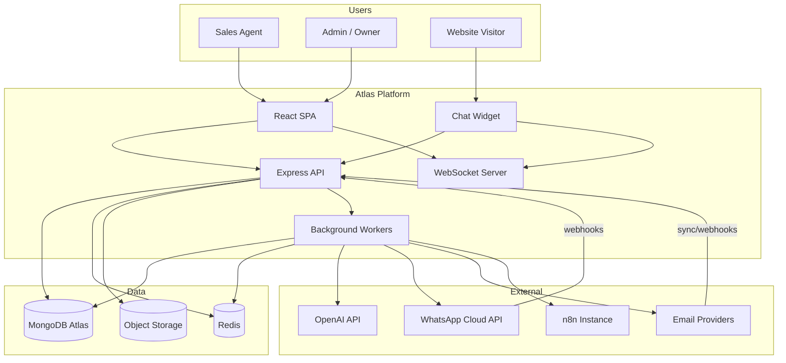

### Layered Architecture

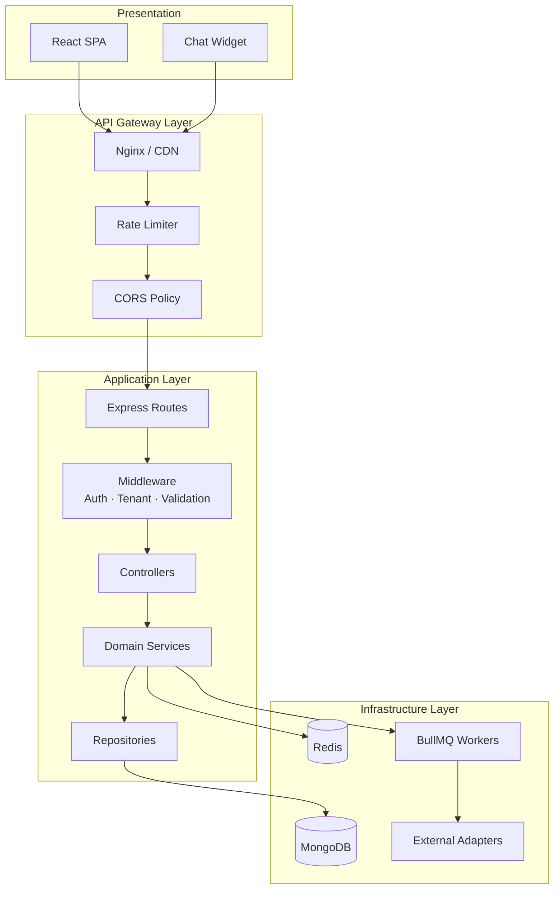

### Domain Modules (Backend)

| Module | Responsibility |
|---|---|
| **auth** | Signup, login, sessions, invitations, password reset |
| **companies** | Tenant settings, pipeline, AI config |
| **users** | Team management, roles, preferences |
| **leads** | CRM CRUD, assignment, import/export |
| **conversations** | Thread management, inbox queries |
| **messages** | Send/receive, delivery status, attachments |
| **integrations** | WhatsApp, email, chat widget connectors |
| **ai** | Draft generation, guardrails, usage tracking |
| **automations** | Webhook registration, event dispatch |
| **notifications** | In-app + email notifications |
| **analytics** | KPI queries, daily aggregation jobs |
| **webhooks** | Inbound provider webhooks (Meta, email, widget) |

---

## 4. Backend Architecture

### 4.1 Architectural Pattern

The backend is a **modular monolith** with **hexagonal (ports & adapters)** boundaries:

- **Domain services** contain business logic and are framework-agnostic.
- **Repositories** abstract MongoDB access (Mongoose or native driver).
- **Adapters** wrap external systems (OpenAI, Meta, Gmail, n8n HTTP).
- **Workers** consume queue jobs for async, retryable operations.

This avoids microservices complexity for MVP while preserving clean extraction paths post-MVP.

### 4.2 Request Lifecycle

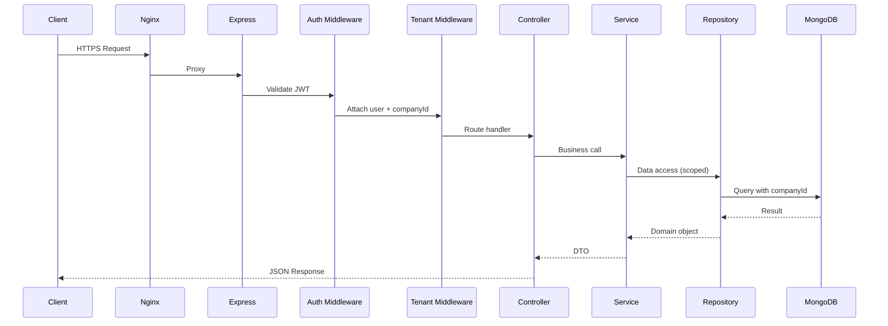

### 4.3 Process Model

| Process | Responsibility | Scaling |
|---|---|---|
| **api** | HTTP REST, inbound webhooks, WebSocket | Horizontal (stateless) |
| **worker** | Message ingest, AI jobs, outbound send, webhook dispatch, analytics | Horizontal by queue consumer |
| **scheduler** | Cron: email sync poll, token refresh, daily aggregates | Single leader (Redlock) |

### 4.4 Middleware Stack (Order)

```
1. requestId          → correlation ID (x-request-id)
2. helmet             → security headers
3. cors               → origin allowlist
4. rateLimiter        → Redis-backed per-IP / per-tenant
5. bodyParser         → JSON (size limit 1MB; webhooks 5MB)
6. requestLogger      → structured access log
7. authenticate       → JWT validation (protected routes)
8. tenantScope        → inject + enforce companyId
9. authorize          → RBAC per route
10. validate          → Zod schema validation
11. errorHandler      → uniform error responses
```

### 4.5 Domain Services

| Service | Key Operations |
|---|---|
| `AuthService` | signup, login, refresh, logout, invite, resetPassword |
| `LeadService` | create, update, archive, merge, assign, duplicateCheck, importCsv |
| `ConversationService` | getOrCreateThread, listInbox, markRead, close |
| `MessageService` | ingestInbound, sendOutbound, updateDeliveryStatus |
| `IntegrationService` | connectWhatsApp, connectEmail, configureWidget, healthCheck |
| `AiService` | generateDraft, acceptDraft, rejectDraft, buildPrompt |
| `AutomationService` | registerWebhook, dispatchEvent, retryDelivery |
| `NotificationService` | create, markRead, sendEmailNotification |
| `AnalyticsService` | getDashboard, getFunnel, aggregateDaily |

### 4.6 External Adapters

| Adapter | Interface | Implementation |
|---|---|---|
| `IAiProvider` | `generateCompletion(prompt, options)` | `OpenAiAdapter` |
| `IWhatsAppProvider` | `sendMessage`, `parseWebhook` | `MetaCloudApiAdapter` |
| `IEmailProvider` | `send`, `fetchNew`, `parseWebhook` | `GmailAdapter`, `MicrosoftAdapter`, `SmtpAdapter` |
| `IStorageProvider` | `upload`, `getSignedUrl` | `S3Adapter` |
| `IWebhookDispatcher` | `dispatch(url, payload, signature)` | `HttpWebhookAdapter` |

### 4.7 Background Jobs (BullMQ)

| Queue | Job Types | Priority |
|---|---|---|
| `inbound-messages` | `processWhatsAppWebhook`, `processEmailMessage`, `processChatMessage` | High |
| `outbound-messages` | `sendWhatsApp`, `sendEmail` | High |
| `ai` | `generateDraft` | Normal |
| `automations` | `dispatchWebhook`, `retryWebhook` | Normal |
| `notifications` | `sendInApp`, `sendEmailNotification` | Normal |
| `analytics` | `aggregateDaily`, `computeFirstResponse` | Low |
| `maintenance` | `refreshOAuthTokens`, `integrationHealthCheck` | Low |

### 4.8 WebSocket Events

| Event | Direction | Payload |
|---|---|---|
| `message:new` | Server → Client | New inbound/outbound message |
| `conversation:updated` | Server → Client | Unread count, preview |
| `lead:updated` | Server → Client | Stage, owner changes |
| `notification:new` | Server → Client | In-app notification |
| `ai:draft:ready` | Server → Client | AI draft completed |
| `widget:message` | Bidirectional | Widget ↔ agent chat |

**Room strategy:** `company:{companyId}` for tenant broadcast; `user:{userId}` for personal notifications; `conversation:{conversationId}` for widget sessions.

---

## 5. Frontend Architecture

### 5.1 Application Structure

The workspace is a **React SPA** built with **Vite**, **TypeScript**, and **Tailwind CSS**. Routing via **React Router v6**. Server state via **TanStack Query**; client UI state via **Zustand** (or React Context for small slices).

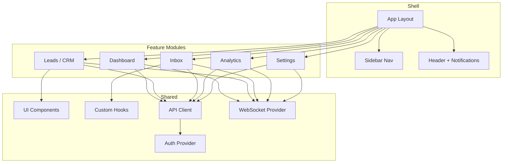

### 5.2 Route Map

| Path | Module | Access |
|---|---|---|
| `/login` | Auth | Public |
| `/signup` | Auth | Public |
| `/invite/:token` | Auth | Public |
| `/forgot-password` | Auth | Public |
| `/` | Dashboard | Authenticated |
| `/inbox` | Inbox | Agent+ |
| `/inbox/:conversationId` | Inbox Detail | Agent+ |
| `/leads` | CRM List | Agent+ |
| `/leads/:leadId` | Lead Detail | Agent+ |
| `/analytics` | Analytics | Agent+ |
| `/settings/*` | Settings | Admin+ |
| `/settings/integrations` | Integrations | Admin+ |
| `/settings/automations` | Automations | Admin+ |
| `/settings/team` | Team | Admin+ |
| `/settings/ai` | AI Config | Admin+ |

### 5.3 State Management Strategy

| State Type | Tool | Examples |
|---|---|---|
| **Server state** | TanStack Query | Leads list, conversation messages, analytics |
| **Auth session** | Context + secure storage | JWT access token, refresh flow |
| **UI ephemeral** | useState / Zustand | Modal open, compose draft, filters |
| **Real-time** | WebSocket + Query invalidation | New messages invalidate inbox queries |
| **Optimistic updates** | TanStack Query mutations | Stage change, mark read, send message |

### 5.4 Key UI Composition

**Inbox (highest complexity)**

```
InboxPage
├── ConversationListPanel     ← filters, search, unread badges
├── ConversationThreadPanel     ← message timeline, channel indicator
│   ├── MessageBubble
│   ├── AiDraftPanel            ← generate, edit, accept, reject
│   └── ComposeBar
└── LeadContextPanel            ← lead summary, stage, tags, notes
```

**Lead Detail**

```
LeadDetailPage
├── LeadHeader                  ← name, stage selector, assignee
├── ActivityTimeline            ← messages, notes, stage changes
├── ConversationsTabs           ← per-channel threads
└── LeadSidebar                 ← fields, tags, source
```

### 5.5 Chat Widget (Separate Bundle)

| Aspect | Decision |
|---|---|
| **Build** | Separate Vite project → `widget.js` (UMD/IIFE) |
| **Embed** | `<script src="https://cdn.atlas.ai/widget.js" data-widget-id="...">` |
| **Auth** | Widget ID + domain allowlist validation |
| **Transport** | WebSocket with session token issued on init |
| **Styling** | Tailwind with CSS scoping / shadow DOM to avoid host conflicts |

### 5.6 Design System (Tailwind)

| Category | Convention |
|---|---|
| **Colors** | CSS variables for brand primary; slate neutrals |
| **Components** | Headless UI + custom primitives (Button, Input, Badge, Modal, Table) |
| **Typography** | Inter / system sans |
| **Icons** | Lucide React |
| **Forms** | React Hook Form + Zod |
| **Toasts** | Sonner or custom Toast provider |

---

## 6. API Architecture

### 6.1 API Style

- **REST** over HTTPS, JSON request/response
- **Versioned** URI prefix: `/api/v1`
- **OpenAPI 3.1** spec generated from Zod schemas (or maintained alongside)
- **Consistent envelope** for errors; direct data for success

### 6.2 Response Conventions

**Success:**

```json
{
  "data": { },
  "meta": { "page": 1, "limit": 25, "total": 142 }
}
```

**Error:**

```json
{
  "error": {
    "code": "LEAD_NOT_FOUND",
    "message": "Lead not found",
    "requestId": "req_abc123"
  }
}
```

### 6.3 Authentication on API

| Token | Location | TTL |
|---|---|---|
| **Access token** | `Authorization: Bearer <jwt>` | 15 minutes |
| **Refresh token** | HttpOnly cookie `atlas_refresh` | 7 days |

### 6.4 API Surface (MVP)

#### Auth

| Method | Endpoint | Description |
|---|---|---|
| POST | `/api/v1/auth/signup` | Register company + owner |
| POST | `/api/v1/auth/login` | Login |
| POST | `/api/v1/auth/refresh` | Refresh access token |
| POST | `/api/v1/auth/logout` | Revoke session |
| POST | `/api/v1/auth/forgot-password` | Request reset |
| POST | `/api/v1/auth/reset-password` | Reset with token |
| POST | `/api/v1/auth/invite` | Invite team member |
| POST | `/api/v1/auth/accept-invite` | Accept invitation |

#### Leads

| Method | Endpoint | Description |
|---|---|---|
| GET | `/api/v1/leads` | List (filter, search, paginate) |
| POST | `/api/v1/leads` | Create lead |
| GET | `/api/v1/leads/:id` | Get lead + summary |
| PATCH | `/api/v1/leads/:id` | Update lead |
| DELETE | `/api/v1/leads/:id` | Archive lead |
| POST | `/api/v1/leads/:id/assign` | Assign owner |
| POST | `/api/v1/leads/import` | CSV import |
| GET | `/api/v1/leads/export` | CSV export |
| GET | `/api/v1/leads/:id/activity` | Activity timeline |

#### Conversations & Messages

| Method | Endpoint | Description |
|---|---|---|
| GET | `/api/v1/conversations` | Inbox list |
| GET | `/api/v1/conversations/:id` | Thread metadata |
| GET | `/api/v1/conversations/:id/messages` | Message history |
| POST | `/api/v1/conversations/:id/messages` | Send outbound message |
| POST | `/api/v1/conversations/:id/read` | Mark read |
| PATCH | `/api/v1/conversations/:id` | Close / snooze |

#### AI

| Method | Endpoint | Description |
|---|---|---|
| POST | `/api/v1/ai/drafts` | Generate reply draft |
| GET | `/api/v1/ai/drafts/:id` | Get draft status |
| POST | `/api/v1/ai/drafts/:id/accept` | Accept + send |
| POST | `/api/v1/ai/drafts/:id/reject` | Discard draft |

#### Integrations

| Method | Endpoint | Description |
|---|---|---|
| GET | `/api/v1/integrations` | List connections |
| POST | `/api/v1/integrations/whatsapp` | Connect WhatsApp |
| POST | `/api/v1/integrations/email` | Connect email (OAuth) |
| POST | `/api/v1/integrations/chat-widget` | Configure widget |
| GET | `/api/v1/integrations/:id/health` | Health check |
| DELETE | `/api/v1/integrations/:id` | Disconnect |

#### Automations

| Method | Endpoint | Description |
|---|---|---|
| GET | `/api/v1/automations` | List webhooks |
| POST | `/api/v1/automations` | Register endpoint |
| PATCH | `/api/v1/automations/:id` | Update |
| DELETE | `/api/v1/automations/:id` | Remove |
| GET | `/api/v1/automations/:id/deliveries` | Delivery log |

#### Analytics & Dashboard

| Method | Endpoint | Description |
|---|---|---|
| GET | `/api/v1/dashboard` | KPI summary |
| GET | `/api/v1/analytics/leads` | Lead metrics |
| GET | `/api/v1/analytics/response-time` | First response |
| GET | `/api/v1/analytics/funnel` | Pipeline funnel |
| GET | `/api/v1/analytics/channels` | Channel mix |

#### Settings

| Method | Endpoint | Description |
|---|---|---|
| GET | `/api/v1/settings/company` | Org settings |
| PATCH | `/api/v1/settings/company` | Update org |
| GET | `/api/v1/settings/pipeline` | Pipeline stages |
| PATCH | `/api/v1/settings/pipeline` | Update stages |
| PATCH | `/api/v1/settings/ai` | AI configuration |
| GET | `/api/v1/users` | Team list |
| PATCH | `/api/v1/users/:id` | Update user/role |
| DELETE | `/api/v1/users/:id` | Deactivate |

#### Notifications

| Method | Endpoint | Description |
|---|---|---|
| GET | `/api/v1/notifications` | User notifications |
| POST | `/api/v1/notifications/read` | Mark read (bulk) |

#### Inbound Webhooks (Public, Signed)

| Method | Endpoint | Source |
|---|---|---|
| GET/POST | `/api/v1/webhooks/whatsapp` | Meta Cloud API |
| POST | `/api/v1/webhooks/email/:provider` | Email provider |
| POST | `/api/v1/webhooks/widget` | Chat widget events |

#### Widget Public API

| Method | Endpoint | Description |
|---|---|---|
| POST | `/api/v1/widget/init` | Initialize session |
| POST | `/api/v1/widget/messages` | Visitor send message |
| GET | `/api/v1/widget/messages` | Poll/stream messages |

### 6.5 RBAC Matrix

| Resource | Owner | Admin | Agent | Viewer |
|---|---|---|---|---|
| Leads CRUD | ✓ | ✓ | ✓ (no delete) | Read |
| Send messages | ✓ | ✓ | ✓ | ✗ |
| AI drafts | ✓ | ✓ | ✓ | ✗ |
| Integrations | ✓ | ✓ | ✗ | ✗ |
| Automations | ✓ | ✓ | ✗ | ✗ |
| Team management | ✓ | ✓ | ✗ | ✗ |
| Analytics | ✓ | ✓ | ✓ | ✓ |
| Settings / AI config | ✓ | ✓ | ✗ | ✗ |

### 6.6 Pagination & Filtering

```
GET /api/v1/leads?stage=qualified&owner=uid&source=whatsapp&search=ada&page=1&limit=25&sort=-lastMessageAt
```

| Param | Type | Notes |
|---|---|---|
| `page` | int | 1-based |
| `limit` | int | Max 100 |
| `sort` | string | `-field` desc, `+field` asc |
| `search` | string | Full-text on name, email, company |

---

## 7. Authentication Flow

### 7.1 Signup & Onboarding

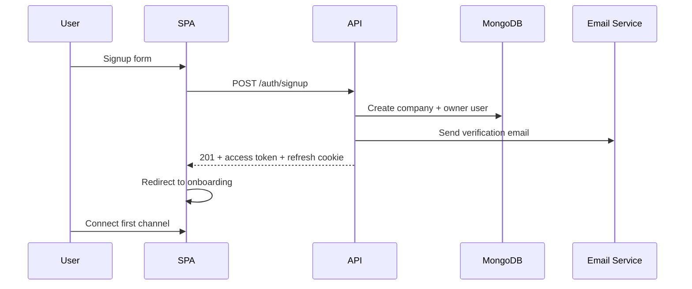

### 7.2 Login & Token Refresh

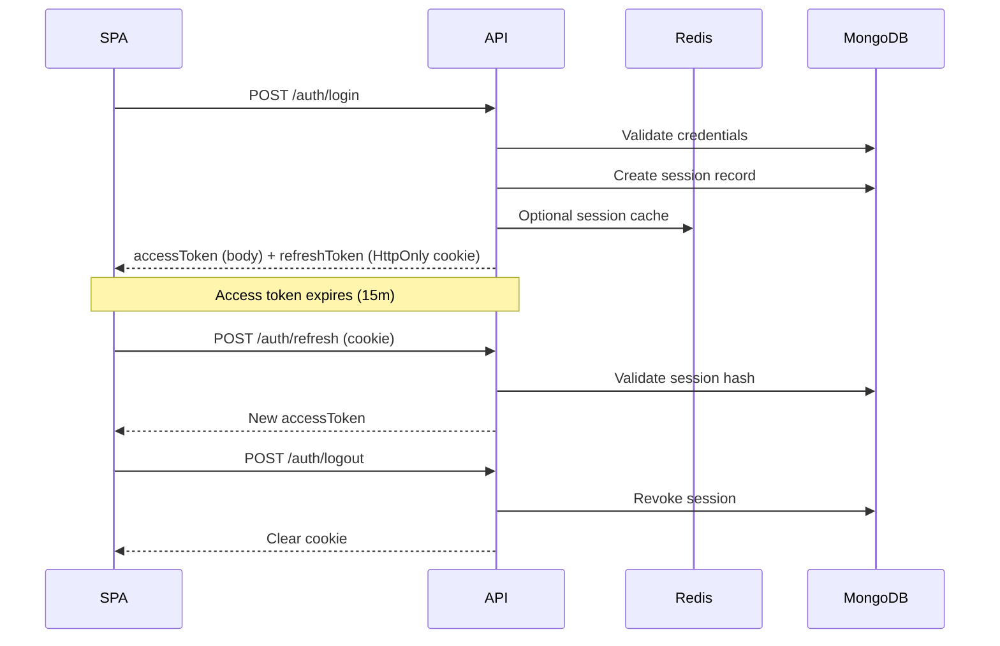

### 7.3 JWT Claims

```json
{
  "sub": "userId",
  "companyId": "companyId",
  "role": "agent",
  "email": "user@company.com",
  "iat": 1720000000,
  "exp": 1720000900
}
```

### 7.4 Team Invitation Flow

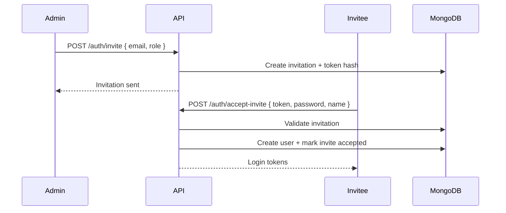

### 7.5 Auth Security Rules

- Passwords hashed with **bcrypt** (cost 12) or **argon2id**
- Refresh tokens stored as **SHA-256 hash** in `sessions` collection
- Invite and reset tokens: single-use, 24h expiry, hashed at rest
- Failed login rate limit: 5 attempts / 15 min per email+IP
- JWT signed with RS256 (asymmetric) or HS256 with strong secret rotated quarterly

---

## 8. Data Flow

### 8.1 Inbound WhatsApp Message

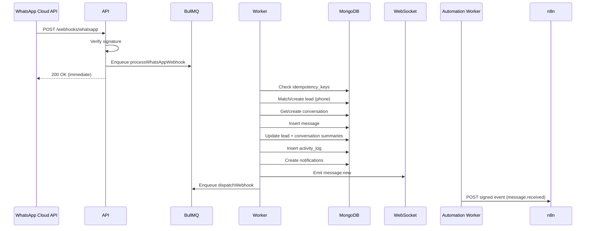

### 8.2 Outbound Agent Reply

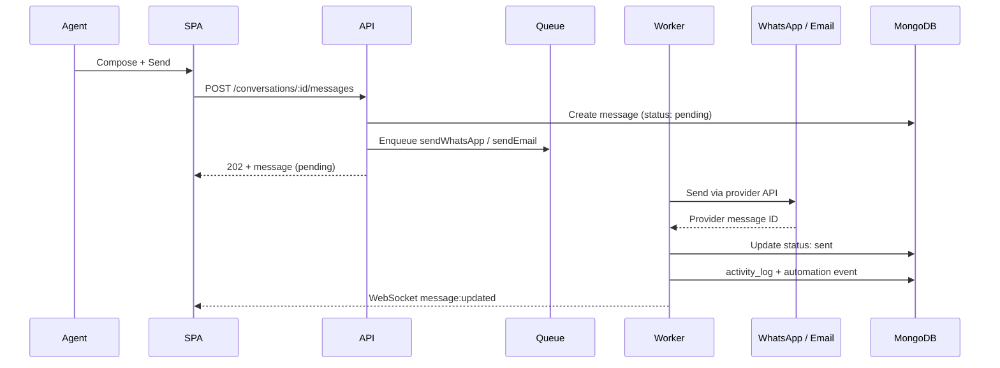

### 8.3 Website Chat Widget Flow

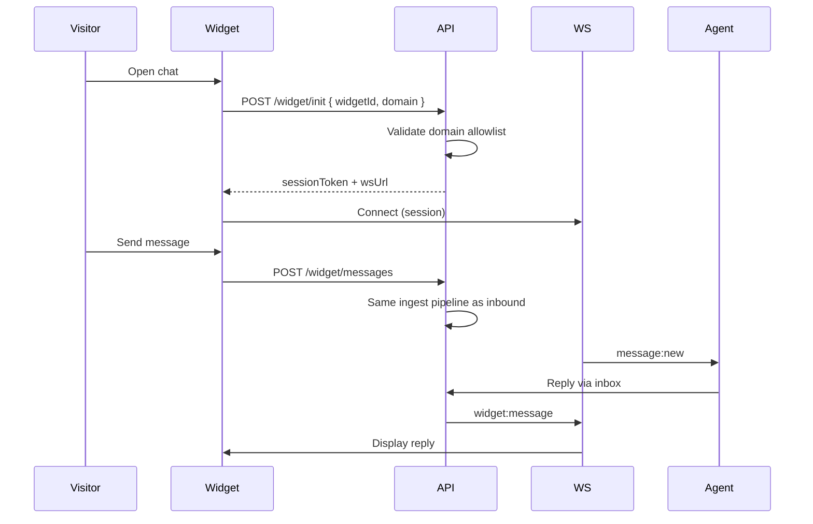

### 8.4 Email Sync Flow

| Mode | MVP Approach |
|---|---|
| **Inbound (Gmail/Outlook)** | OAuth + periodic poll (every 2 min) via `scheduler`; push via provider webhook where available |
| **Outbound** | Send via connected account API (Gmail send / Graph send) |
| **Threading** | Match by `Message-ID`, `In-Reply-To`, `References` headers + subject |

### 8.5 Analytics Data Flow

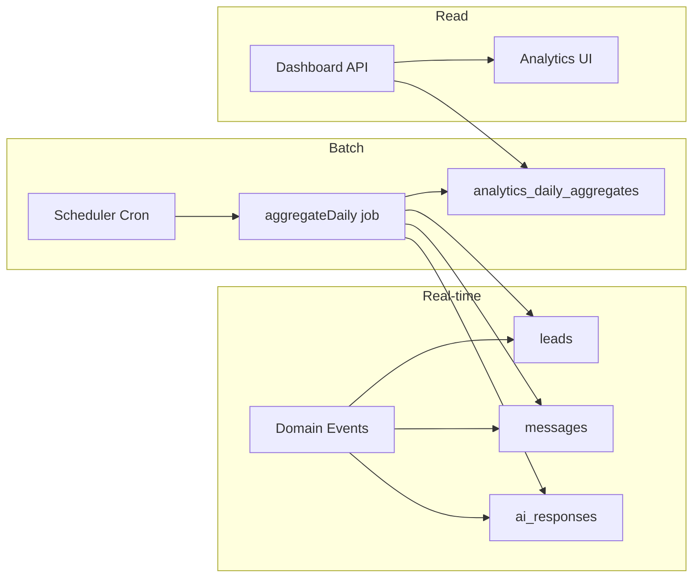

---

## 9. AI Flow

### 9.1 Design Principles

1. **Human-in-the-loop by default** — AI produces drafts; agents approve before send.
2. **Context-grounded** — Prompt includes lead fields, stage, company AI settings, recent messages (last N), knowledge snippets.
3. **Async generation** — OpenAI call runs in worker; UI shows loading state via WebSocket.
4. **Guardrails** — Refuse prohibited topics; never invent pricing/availability not in knowledge base.
5. **Observable** — Log model, tokens, latency, acceptance rate to `ai_responses`.

### 9.2 AI Draft Generation Flow

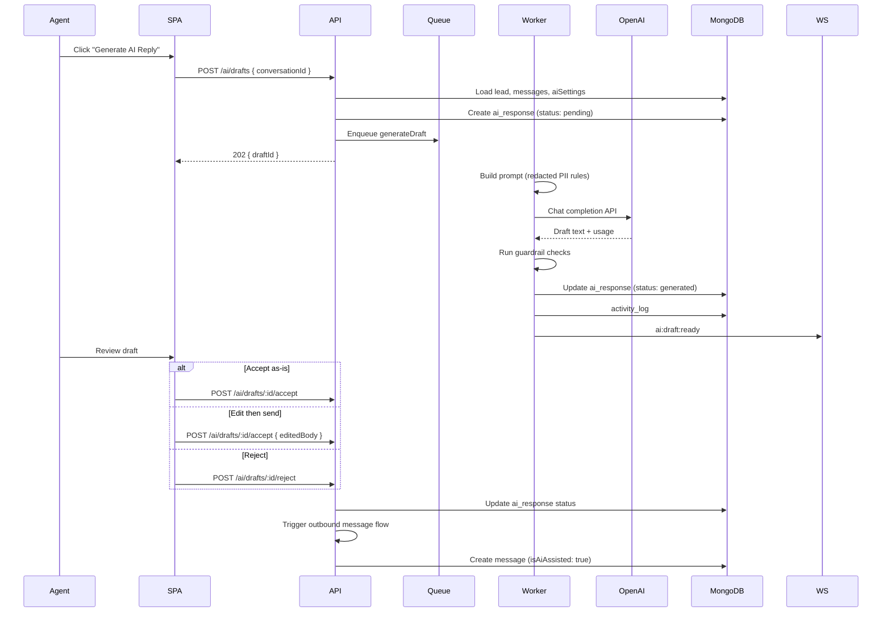

### 9.3 Prompt Composition

| Section | Source |
|---|---|
| **System** | Company `aiSettings.tone`, `doRules`, `dontRules`, knowledge snippets |
| **Context** | Lead name, stage, source, tags, company name |
| **Conversation** | Last 10–20 messages (chronological), channel noted |
| **Instruction** | Generate reply, suggest qualification questions, detect language |
| **Constraints** | Max length per channel; no fabricated facts |

### 9.4 Guardrails

| Check | Action |
|---|---|
| Missing pricing in knowledge + pricing question | Flag `missing_pricing_data`; draft suggests asking for clarification |
| Prohibited topic (per dontRules) | Status `failed`; return safe fallback message |
| OpenAI moderation flag | Block draft; log incident |
| Token limit exceeded | Truncate conversation context; summarize older messages |

### 9.5 AI Failure Degradation

If OpenAI is unavailable:

- API returns `503` with code `AI_PROVIDER_UNAVAILABLE`
- UI shows manual compose only
- No blocking of message send path
- Retry with exponential backoff (3 attempts)

---

## 10. Automation Flow

### 10.1 Model

Atlas emits **domain events** to customer-registered **HTTPS webhook endpoints** (typically n8n webhook trigger nodes). Atlas does **not** embed n8n as an internal executor for MVP—customers run their own n8n instance.

### 10.2 Event Types

| Event | Trigger |
|---|---|
| `lead.created` | New lead record |
| `lead.updated` | Lead fields changed |
| `lead.stage_changed` | Pipeline stage transition |
| `lead.assigned` | Owner assignment |
| `message.received` | Inbound message stored |
| `message.sent` | Outbound message confirmed sent |
| `conversation.created` | New thread |
| `integration.error` | Connector health failure |
| `ai.draft_generated` | AI draft ready |
| `ai.draft_sent` | AI-assisted message sent |

### 10.3 Dispatch Flow

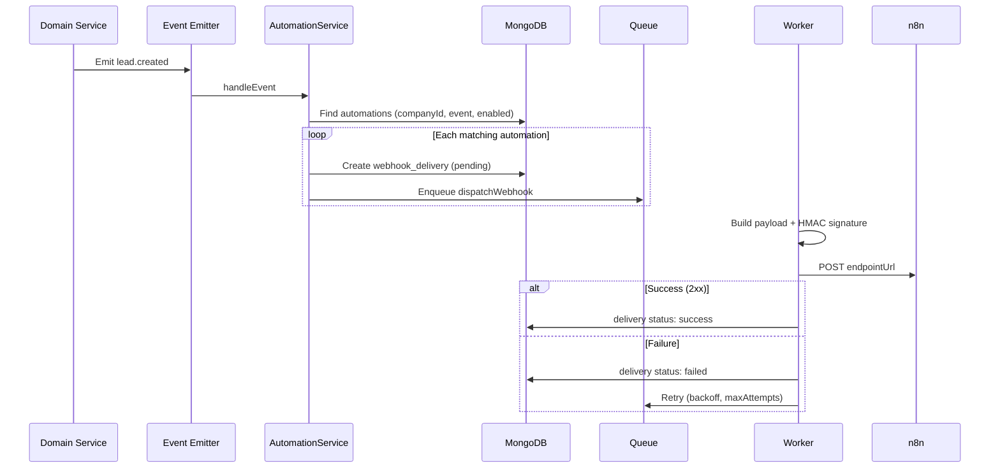

### 10.4 Webhook Payload Schema

```json
{
  "id": "evt_abc123",
  "type": "lead.created",
  "createdAt": "2026-07-14T10:28:00Z",
  "companyId": "66a...010",
  "data": {
    "lead": {
      "id": "66a...001",
      "firstName": "Ada",
      "email": "ada@example.com",
      "phone": "+2348012345678",
      "source": "whatsapp",
      "stageId": "stage-new"
    }
  }
}
```

**Headers:**

```
Content-Type: application/json
X-Atlas-Event: lead.created
X-Atlas-Delivery: del_xyz789
X-Atlas-Signature: sha256=HMAC_HEX
X-Atlas-Timestamp: 1720000000
```

### 10.5 Starter n8n Workflows (Shipped as Templates)

| Template | Trigger Event | Action |
|---|---|---|
| New Lead Slack Alert | `lead.created` | Post to Slack channel |
| After-Hours Auto-Ack | `message.received` | Check business hours → send template reply |
| Stage Change Email | `lead.stage_changed` | Email manager on qualified |
| Integration Failure Pager | `integration.error` | SMS / email admin |
| Daily Lead Digest | Cron (n8n-side) | Pull `GET /analytics/leads` |

### 10.6 Retry Policy

| Attempt | Delay |
|---|---|
| 1 | Immediate |
| 2 | 1 minute |
| 3 | 5 minutes |
| 4 | 30 minutes |
| 5 | 2 hours |

After max attempts: mark failed, increment `automations.failureCount`, notify admin via `notifications`.

---

## 11. Security Considerations

### 11.1 Security Architecture

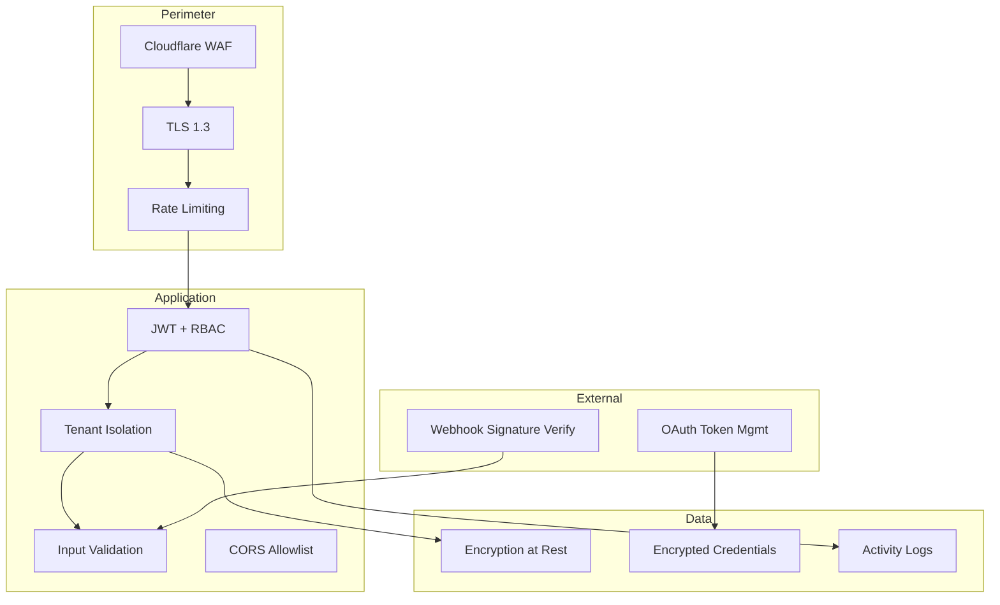

### 11.2 Threat Model & Mitigations

| Threat | Mitigation |
|---|---|
| **Cross-tenant data access** | `companyId` enforced in middleware + repository layer; integration tests |
| **JWT theft** | Short-lived access tokens; refresh in HttpOnly Secure SameSite cookie |
| **Webhook spoofing** | Verify Meta `X-Hub-Signature-256`; Atlas signs outbound webhooks with HMAC |
| **Widget abuse** | Domain allowlist; widget rate limit per session/IP |
| **Credential exposure** | AES-256-GCM encryption for integration tokens; never return to client |
| **XSS** | React escaping; sanitize email HTML (DOMPurify); CSP headers |
| **CSRF** | SameSite cookies; CSRF token for cookie-auth endpoints if needed |
| **Injection** | Zod validation; parameterized MongoDB queries (no raw user input in `$where`) |
| **Brute force** | Redis rate limits on auth endpoints |
| **PII leakage in logs** | Redact emails/phones in logs; no prompt content in production logs |
| **AI prompt injection** | System prompt constraints; separate user content block; output guardrails |

### 11.3 Compliance Posture (MVP)

| Area | MVP Stance |
|---|---|
| **GDPR** | Data export (CSV), erasure workflow, privacy policy disclosure |
| **Data residency** | MongoDB Atlas region selection per deployment |
| **AI data handling** | OpenAI API data usage policy; opt-out of training where available |
| **WhatsApp** | Meta Business Policy compliance; template messaging rules documented |
| **Email** | SPF/DKIM guidance for custom domains (post-MVP) |

### 11.4 Secrets Management

| Secret | Storage |
|---|---|
| JWT signing key | Secrets manager |
| Integration OAuth tokens | MongoDB encrypted + KMS key |
| Webhook HMAC secrets | Hashed in DB; plaintext shown once on create |
| OpenAI API key | Server env only; never client |
| Meta app secret | Server env; used for webhook verification |

---

## 12. Folder Structure

### 12.1 Monorepo Layout

```
project-atlas-ai/
├── apps/
│   ├── web/                          # React SPA (workspace)
│   ├── widget/                       # Chat widget bundle
│   ├── api/                          # Express API server
│   └── worker/                       # Background job workers
├── packages/
│   ├── shared/                       # Shared types, constants, enums
│   ├── validation/                   # Zod schemas (API + forms)
│   └── ui/                           # Optional shared UI primitives
├── docs/
│   ├── MVP_SPECIFICATION.md
│   ├── DATABASE_ARCHITECTURE.md
│   └── SYSTEM_ARCHITECTURE.md
├── infra/
│   ├── docker/
│   │   ├── Dockerfile.api
│   │   ├── Dockerfile.worker
│   │   ├── Dockerfile.web
│   │   └── docker-compose.yml
│   ├── nginx/
│   │   └── nginx.conf
│   └── scripts/
│       ├── seed.ts
│       └── migrate.ts
├── n8n-templates/                    # Starter workflow JSON exports
├── .github/
│   └── workflows/
│       ├── ci.yml
│       └── deploy.yml
├── package.json                      # Workspace root (pnpm/turbo)
├── pnpm-workspace.yaml
├── turbo.json
└── README.md
```

### 12.2 API (`apps/api/`)

```
apps/api/
├── src/
│   ├── index.ts                      # Entry point
│   ├── app.ts                        # Express app setup
│   ├── config/
│   │   ├── env.ts
│   │   ├── database.ts
│   │   └── redis.ts
│   ├── middleware/
│   │   ├── authenticate.ts
│   │   ├── tenantScope.ts
│   │   ├── authorize.ts
│   │   ├── validate.ts
│   │   ├── rateLimiter.ts
│   │   ├── errorHandler.ts
│   │   └── requestId.ts
│   ├── modules/
│   │   ├── auth/
│   │   │   ├── auth.routes.ts
│   │   │   ├── auth.controller.ts
│   │   │   ├── auth.service.ts
│   │   │   └── auth.repository.ts
│   │   ├── leads/
│   │   ├── conversations/
│   │   ├── messages/
│   │   ├── integrations/
│   │   ├── ai/
│   │   ├── automations/
│   │   ├── notifications/
│   │   ├── analytics/
│   │   ├── settings/
│   │   └── webhooks/
│   ├── adapters/
│   │   ├── openai/
│   │   ├── whatsapp/
│   │   ├── email/
│   │   ├── storage/
│   │   └── webhook/
│   ├── events/
│   │   ├── eventBus.ts
│   │   └── eventTypes.ts
│   ├── websocket/
│   │   ├── server.ts
│   │   └── handlers.ts
│   ├── jobs/
│   │   ├── queues.ts
│   │   └── producers.ts
│   ├── models/                       # Mongoose schemas
│   ├── utils/
│   │   ├── crypto.ts
│   │   ├── pagination.ts
│   │   └── logger.ts
│   └── types/
├── tests/
│   ├── unit/
│   ├── integration/
│   └── e2e/
├── package.json
└── tsconfig.json
```

### 12.3 Worker (`apps/worker/`)

```
apps/worker/
├── src/
│   ├── index.ts
│   ├── processors/
│   │   ├── inboundMessage.processor.ts
│   │   ├── outboundMessage.processor.ts
│   │   ├── aiDraft.processor.ts
│   │   ├── webhookDispatch.processor.ts
│   │   ├── notification.processor.ts
│   │   └── analytics.processor.ts
│   ├── schedulers/
│   │   ├── emailSync.cron.ts
│   │   ├── tokenRefresh.cron.ts
│   │   └── dailyAggregate.cron.ts
│   └── config/
├── package.json
└── tsconfig.json
```

### 12.4 Web (`apps/web/`)

```
apps/web/
├── src/
│   ├── main.tsx
│   ├── App.tsx
│   ├── routes/
│   │   └── index.tsx
│   ├── features/
│   │   ├── auth/
│   │   │   ├── pages/
│   │   │   ├── components/
│   │   │   └── hooks/
│   │   ├── dashboard/
│   │   ├── inbox/
│   │   ├── leads/
│   │   ├── analytics/
│   │   └── settings/
│   ├── components/
│   │   ├── ui/                       # Button, Input, Modal, Badge, etc.
│   │   └── layout/                   # Sidebar, Header, PageShell
│   ├── lib/
│   │   ├── api-client.ts
│   │   ├── websocket.ts
│   │   └── auth.ts
│   ├── hooks/
│   ├── stores/
│   ├── types/
│   └── styles/
│       └── globals.css
├── public/
├── index.html
├── vite.config.ts
├── tailwind.config.ts
├── package.json
└── tsconfig.json
```

### 12.5 Widget (`apps/widget/`)

```
apps/widget/
├── src/
│   ├── index.ts                      # UMD entry
│   ├── Widget.tsx
│   ├── components/
│   ├── hooks/
│   └── api.ts
├── vite.config.ts
└── package.json
```

### 12.6 Shared Packages

```
packages/
├── shared/
│   └── src/
│       ├── enums.ts
│       ├── constants.ts
│       └── types/
├── validation/
│   └── src/
│       ├── auth.schema.ts
│       ├── lead.schema.ts
│       ├── message.schema.ts
│       └── index.ts
```

---

## 13. Scalability Considerations

### 13.1 MVP Scale Targets

| Dimension | Target |
|---|---|
| **Tenants** | 50–200 companies |
| **Users** | 500–2,000 |
| **Leads** | 100k total |
| **Messages** | 1M total; ~10k/org/month |
| **Concurrent agents** | ~50 per tenant peak |
| **Webhook throughput** | 100 events/sec burst |

### 13.2 Scaling Dimensions

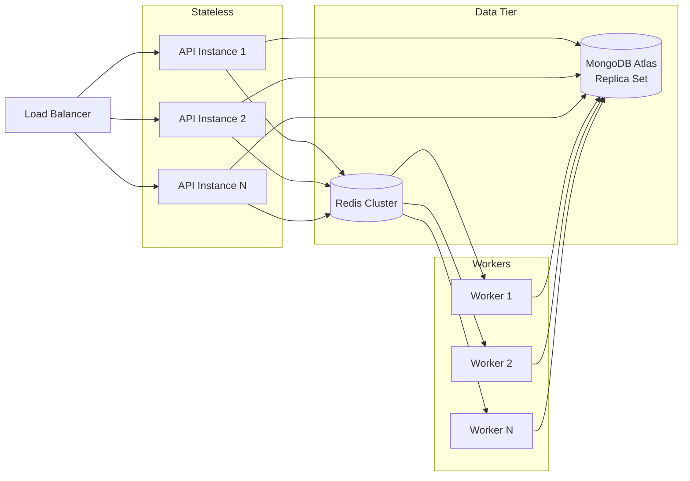

| Component | Scale Strategy |
|---|---|
| **API servers** | Horizontal; stateless behind load balancer |
| **Workers** | Horizontal; increase consumers per queue |
| **MongoDB** | Vertical first (M10→M30); sharding deferred until >500GB or hotspot collections |
| **Redis** | Single instance MVP; cluster when queue depth or memory pressure |
| **WebSocket** | Sticky sessions or Redis adapter for Socket.IO multi-instance |
| **Object storage** | Inherently scalable (S3/R2) |
| **OpenAI** | Rate limit per tenant; queue backpressure; model fallback (4o-mini) |

### 13.3 Database Hotspots & Mitigations

| Hotspot | Mitigation |
|---|---|
| Inbox list queries | Denormalized `lastMessageAt`, `unreadCount` on leads/conversations |
| Message timeline | Compound index `(companyId, conversationId, createdAt)` |
| Webhook dedup | `idempotency_keys` with TTL |
| Analytics dashboards | `analytics_daily_aggregates` pre-computation |
| Activity log growth | TTL archival; separate collection per year if needed |

### 13.4 Caching Strategy

| Cache | TTL | Invalidation |
|---|---|---|
| Company settings | 5 min | On settings update |
| Pipeline stages | 5 min | On pipeline update |
| User session | Redis | On logout / revoke |
| Integration health | 1 min | On health check job |
| Dashboard KPIs | 5 min | On daily aggregate + real-time counter |

### 13.5 Evolution Path (Post-MVP)

| Trigger | Action |
|---|---|
| > 5 engineers | Enforce stricter module boundaries; consider extracting `worker` to separate deploy |
| Message volume > 50k/day | Dedicated message ingest service; MongoDB sharding on `messages` by `companyId` |
| Multi-region demand | Atlas global clusters; CDN for widget; regional API deployment |
| Enterprise SSO | Add auth provider abstraction; SAML service |
| Advanced search | Atlas Search indexes on leads |

### 13.6 Reliability Patterns

- **Idempotency** on all inbound webhooks
- **At-least-once delivery** for outbound webhooks with retry + dedup on consumer side
- **Circuit breaker** on external adapters (OpenAI, Meta) after consecutive failures
- **Dead letter queue** for jobs exceeding max retries
- **Health checks:** `/health` (liveness), `/ready` (Mongo + Redis connectivity)
- **Graceful shutdown:** drain workers, stop accepting new jobs on SIGTERM

---

## 14. Deployment Topology

### 14.1 Environment Strategy

| Environment | Purpose | Infrastructure |
|---|---|---|
| **local** | Development | Docker Compose (Mongo, Redis, API, Web) |
| **staging** | Pre-prod testing | Mirrors prod; smaller instances |
| **production** | Live tenants | Managed containers + Atlas + Redis Cloud |

### 14.2 Production Diagram

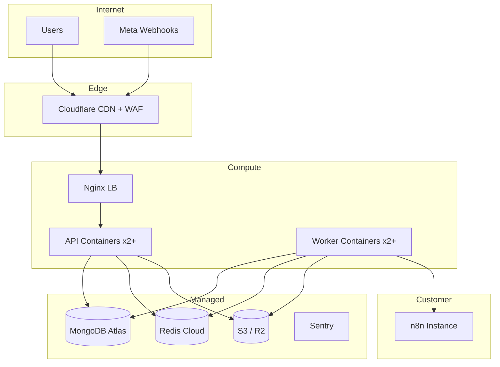

### 14.3 CI/CD Pipeline

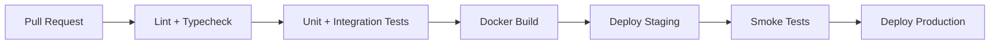

---

## 15. Observability & Operations

### 15.1 Logging

- Structured JSON logs (Pino)
- Correlation: `requestId` propagated from API → workers → webhooks
- Log levels: `error`, `warn`, `info`, `debug`
- Never log: passwords, tokens, full message bodies in production

### 15.2 Metrics

| Metric | Type |
|---|---|
| `http_request_duration_ms` | Histogram |
| `queue_job_duration_ms` | Histogram |
| `queue_depth` | Gauge |
| `messages_inbound_total` | Counter (by channel) |
| `messages_outbound_total` | Counter (by channel) |
| `ai_draft_generated_total` | Counter |
| `ai_draft_accepted_total` | Counter |
| `webhook_delivery_success_total` | Counter |
| `webhook_delivery_failure_total` | Counter |
| `openai_request_duration_ms` | Histogram |

### 15.3 Alerting Thresholds

| Alert | Condition |
|---|---|
| API error rate | > 5% 5xx over 5 min |
| Queue backlog | > 1000 jobs for 10 min |
| Webhook failure spike | > 10% failure rate per tenant |
| MongoDB replication lag | > 30s |
| Integration token expiry | Tokens expiring within 24h |

### 15.4 Runbooks (MVP)

- WhatsApp webhook verification failure
- OAuth token refresh failure (email disconnect)
- OpenAI rate limit / outage
- n8n webhook delivery failures
- Cross-tenant data leak incident response

---

## Appendix A — Technology Decision Records (Summary)

| Decision | Choice | Rationale |
|---|---|---|
| Monolith vs microservices | Modular monolith | Faster MVP; clear module boundaries |
| REST vs GraphQL | REST | Simpler; sufficient for CRUD + webhooks |
| Mongoose vs native driver | Mongoose | Schema validation, middleware, ecosystem |
| BullMQ vs SQS | BullMQ + Redis | Lower ops overhead for MVP scale |
| Socket.IO vs SSE | Socket.IO | Bidirectional widget chat requirement |
| JWT access + refresh cookie | Hybrid | XSS-resistant refresh; stateless API auth |
| n8n external vs embedded | External | Avoid rebuilding workflow engine |

---

## Appendix B — Related Documents

| Document | Path |
|---|---|
| MVP Product Specification | `docs/MVP_SPECIFICATION.md` |
| MongoDB Database Architecture | `docs/DATABASE_ARCHITECTURE.md` |
| API OpenAPI Spec | `docs/openapi.yaml` (to be created) |
| n8n Starter Templates | `n8n-templates/` |

---

## Document Approval

| Role | Name | Date | Signature |
|---|---|---|---|
| Principal Architect | | | |
| Backend Lead | | | |
| Frontend Lead | | | |
| Security | | | |
| Product | | | |

---

*End of System Architecture — Project Atlas AI v1.0*
