# Project Atlas AI — User Journey Specification

| Document Control | |
|---|---|
| **Product** | Project Atlas AI |
| **Document type** | User Journey (UX Flows) |
| **Version** | 1.0 |
| **Status** | Draft for design & engineering alignment |
| **Audience** | Product, UX, Engineering, QA |
| **Scope** | MVP flows — login through AI-assisted reply |
| **Last updated** | 12 August 2026 |

---

## Purpose

This document describes **every major user flow** in Project Atlas AI from first sign-in through sending an AI-generated response. It defines **behavior, not visual design**. Each flow includes entry point, user actions, system actions, success state, and error states.

### Primary Personas

| Persona | Goal in these flows |
|---|---|
| **Owner / Admin** | Configure workspace, integrations, team; oversee pipeline |
| **Sales / Agent** | Respond to leads quickly using AI assist |
| **Manager** | Monitor funnel, analytics, team performance |

### Journey Map (End-to-End)

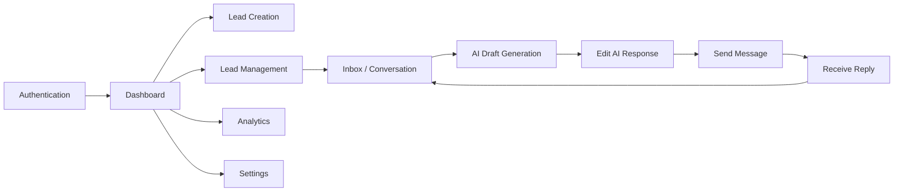

---

## 1. Authentication

### 1.1 Sign In with Google (Primary)

| Aspect | Description |
|---|---|
| **Entry point** | Marketing site → **Sign In**; direct URL `/sign-in`; session expiry redirect |
| **User actions** | Click **Continue with Google** → select Google account → consent if prompted |
| **System actions** | OAuth with Google; create/find user record; create organization on first login; assign Owner role; establish session; redirect to `/dashboard` |
| **Success state** | User lands on Dashboard with authenticated session; sidebar shows workspace name |
| **Error states** | OAuth cancelled → return to sign-in with message; OAuth failure → generic error + retry; account deactivated → contact admin message; provisioning failure → retry + support link |

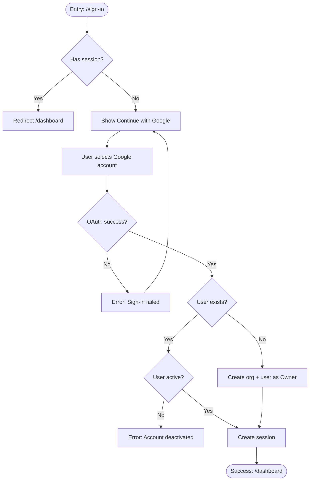

### 1.2 Session Expiry / Re-authentication

| Aspect | Description |
|---|---|
| **Entry point** | User returns after access token expiry; API returns 401 |
| **User actions** | Continue working; may be prompted to sign in again |
| **System actions** | Middleware detects missing session → redirect to `/sign-in?callbackUrl=...`; after login, return to intended page |
| **Success state** | User resumes prior page without data loss where possible |
| **Error states** | Refresh failure → forced logout; callback URL invalid → default to dashboard |

### 1.3 Team Invitation Accept (Admin-initiated)

| Aspect | Description |
|---|---|
| **Entry point** | Email invite link → `/invite/:token` |
| **User actions** | Click link → **Continue with Google** (matching invited email) |
| **System actions** | Validate token; match Google email to invite; attach user to org with assigned role; mark invite accepted |
| **Success state** | User enters workspace Dashboard with assigned role permissions |
| **Error states** | Expired invite; email mismatch; already accepted; org at seat limit |

---

## 2. Dashboard

### 2.1 First Visit (Empty Workspace)

| Aspect | Description |
|---|---|
| **Entry point** | Post-login redirect to `/dashboard` |
| **User actions** | Read onboarding checklist; click **Connect Integration** or **Add Lead** |
| **System actions** | Detect zero leads / no integrations; show guided empty state; load real KPIs (zeros) |
| **Success state** | User understands next step; checklist tracks progress |
| **Error states** | Metrics API failure → show skeleton + retry; partial data → show available metrics with warning |

### 2.2 Returning User Dashboard Load

| Aspect | Description |
|---|---|
| **Entry point** | Sidebar **Dashboard**; post-login default |
| **User actions** | Scan KPIs; change date range; click drill-down links (Leads, Inbox, Analytics) |
| **System actions** | Fetch aggregated metrics from DB; load recent activity; load integration health; apply role-based visibility |
| **Success state** | KPI cards, pipeline snapshot, recent activity, pending follow-ups reflect live data |
| **Error states** | Unauthorized → redirect sign-in; partial fetch failure → degrade gracefully per widget |

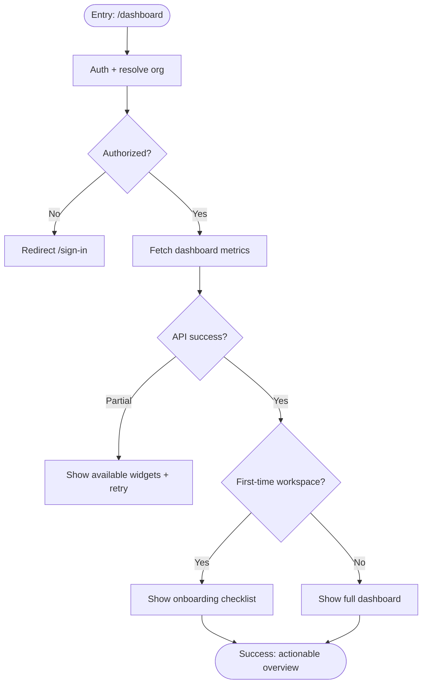

---

## 3. Lead Creation

### 3.1 Manual Lead Create (CRM)

| Aspect | Description |
|---|---|
| **Entry point** | Dashboard **Add Lead**; Leads page **New Lead**; quick-action menu |
| **User actions** | Enter name, email, phone, company, source, stage → **Save** |
| **System actions** | Validate input; duplicate check (email/phone); insert lead scoped to org; log `lead.created`; emit automation event; notify assignee if set |
| **Success state** | Lead appears in pipeline at selected stage; toast confirmation; optional navigate to lead detail |
| **Error states** | Validation errors inline; duplicate detected → suggest merge/view existing; rate limit; permission denied |

### 3.2 Inbound Lead Auto-Create (Channel)

| Aspect | Description |
|---|---|
| **Entry point** | WhatsApp message, email, website chat, webhook, public form |
| **User actions** | *(None — system-initiated)* |
| **System actions** | Webhook/API receives payload → identify org → match/create contact & lead → create conversation → store message → notify agents |
| **Success state** | Lead visible in CRM and Inbox; unread badge increments |
| **Error states** | Unknown org/integration → reject webhook; duplicate webhook → idempotent no-op; malformed payload → log + 400 |

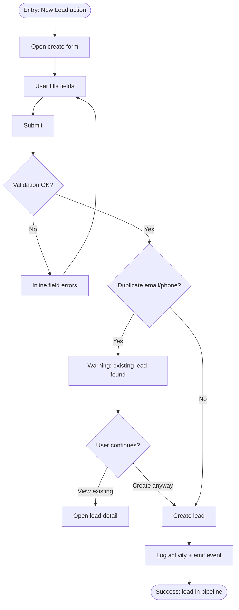

---

## 4. Lead Management

### 4.1 Lead List & Search

| Aspect | Description |
|---|---|
| **Entry point** | Sidebar **Leads** → `/leads` |
| **User actions** | Search; filter by stage, owner, source, channel; sort; open lead |
| **System actions** | Paginated query scoped to org; apply RBAC (Sales may see assigned only if configured) |
| **Success state** | Filtered list matches criteria; counts accurate |
| **Error states** | Empty results → empty state; query timeout → retry |

### 4.2 Pipeline Stage Change

| Aspect | Description |
|---|---|
| **Entry point** | Kanban drag-drop; lead detail stage selector |
| **User actions** | Move card to new stage or select stage from dropdown |
| **System actions** | Update `stage_id`; log `stage_changed`; emit `lead.stage_changed`; update analytics |
| **Success state** | Card appears in new column; activity timeline updated |
| **Error states** | Invalid stage; lead archived; permission denied; concurrent update conflict |

### 4.3 Assign Lead

| Aspect | Description |
|---|---|
| **Entry point** | Lead detail **Assign**; bulk assign from list |
| **User actions** | Select team member → **Assign** |
| **System actions** | Update `owner_id`; notify assignee; log activity |
| **Success state** | Lead shows new owner; assignee receives notification |
| **Error states** | Assignee not in org; viewer role blocked |

### 4.4 Add Note / View Activity

| Aspect | Description |
|---|---|
| **Entry point** | Lead detail **Activity** tab |
| **User actions** | Type note → **Save**; scroll timeline |
| **System actions** | Append activity log entry; merge messages, stage changes, assignments chronologically |
| **Success state** | Note visible in timeline immediately |
| **Error states** | Empty note rejected; save failure with retry |

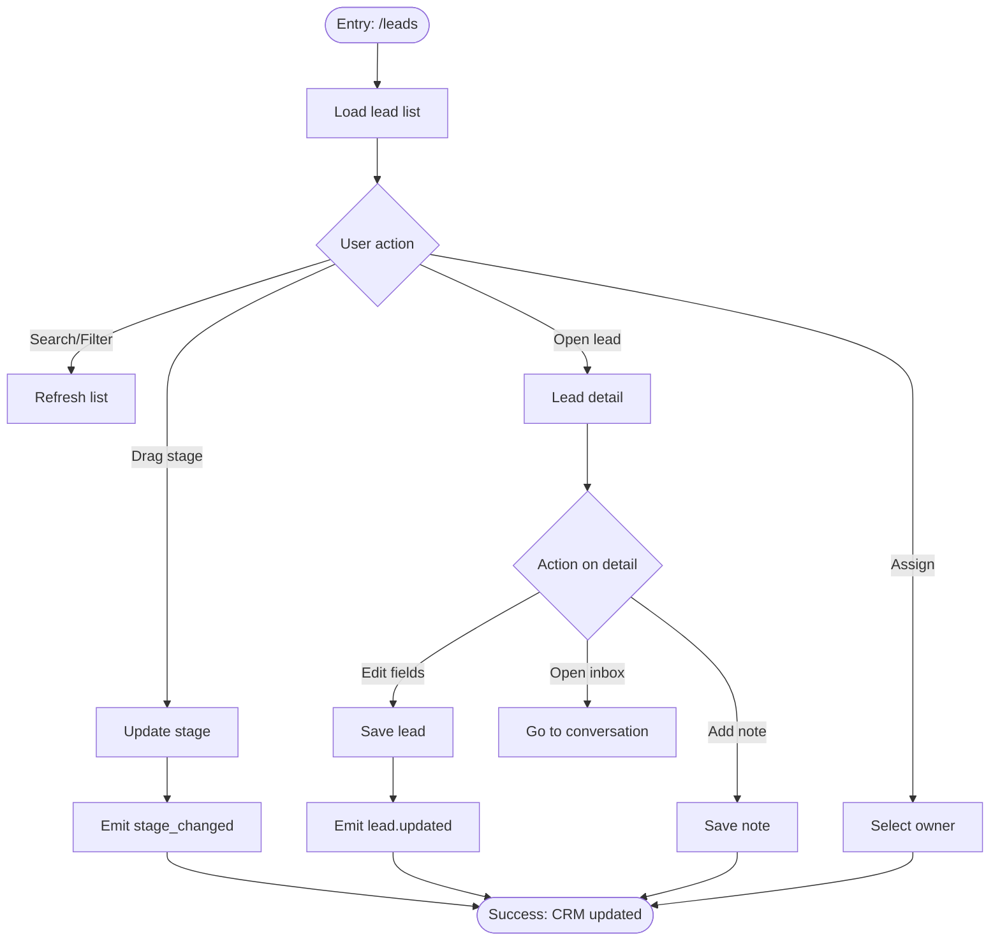

---

## 5. AI Response Generation

### 5.1 Generate Draft from Inbox

| Aspect | Description |
|---|---|
| **Entry point** | Inbox → select conversation → **AI Assist** / **Generate Reply** |
| **User actions** | Click generate; wait for draft |
| **System actions** | Verify conversation ownership; load lead context + message history + org AI settings; call AI provider; store draft in `ai_responses`; log usage; push `ai:draft:ready` if realtime enabled |
| **Success state** | Draft panel opens with suggested reply and optional qualification prompts |
| **Error states** | AI provider down → manual compose only; rate limit → wait message; guardrail block → explain + safe fallback; empty thread → disable generate |

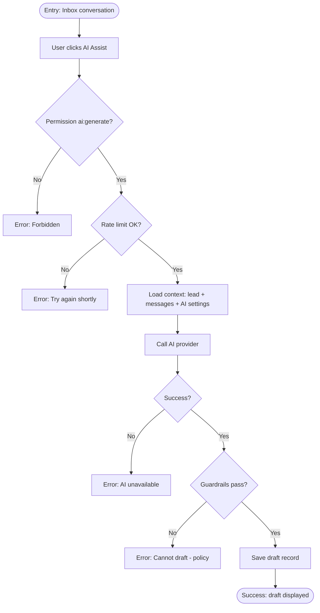

### 5.2 Regenerate Draft

| Aspect | Description |
|---|---|
| **Entry point** | Draft panel → **Regenerate** |
| **User actions** | Click regenerate (optional tone tweak) |
| **System actions** | New AI call; prior draft marked rejected/expired; new draft stored |
| **Success state** | Updated draft replaces previous |
| **Error states** | Same as 5.1 |

---

## 6. Editing AI Responses

| Aspect | Description |
|---|---|
| **Entry point** | AI draft panel after generation |
| **User actions** | Edit text in textarea; optionally use suggested qualification questions |
| **System actions** | Client-side edit until send; on send, compare draft vs final for analytics (`edited` vs `accepted`) |
| **Success state** | User has final message ready to send; character limits validated per channel |
| **Error states** | Empty body on send blocked; exceeds channel limit → truncate warning; draft expired → regenerate prompt |

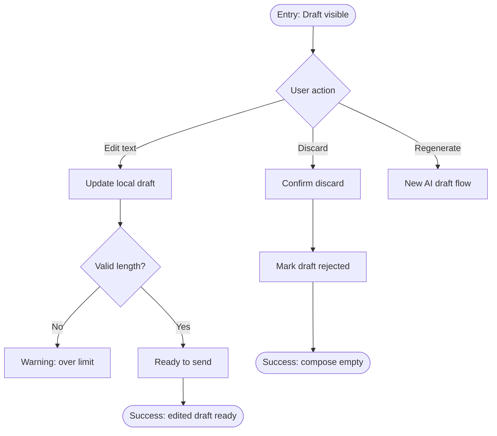

---

## 7. Sending Messages

### 7.1 Send AI-Assisted Reply

| Aspect | Description |
|---|---|
| **Entry point** | Draft panel → **Approve & Send** |
| **User actions** | Review final text → confirm send |
| **System actions** | Create outbound message (pending); link `ai_response_id`; route to channel adapter (WhatsApp/email/chat); update delivery status; update conversation/lead summaries; log activity; emit `message.sent`; clear unread for agent |
| **Success state** | Message appears in thread as outbound; status progresses sent → delivered/read; draft marked accepted/edited |
| **Error states** | Provider failure → message failed with retry; integration disconnected → prompt reconnect; WhatsApp window closed → template required message |

### 7.2 Send Manual Reply (No AI)

| Aspect | Description |
|---|---|
| **Entry point** | Compose bar in inbox |
| **User actions** | Type message → **Send** |
| **System actions** | Same outbound pipeline without AI linkage |
| **Success state** | Message in thread; `is_ai_assisted: false` |
| **Error states** | Same as 7.1 |

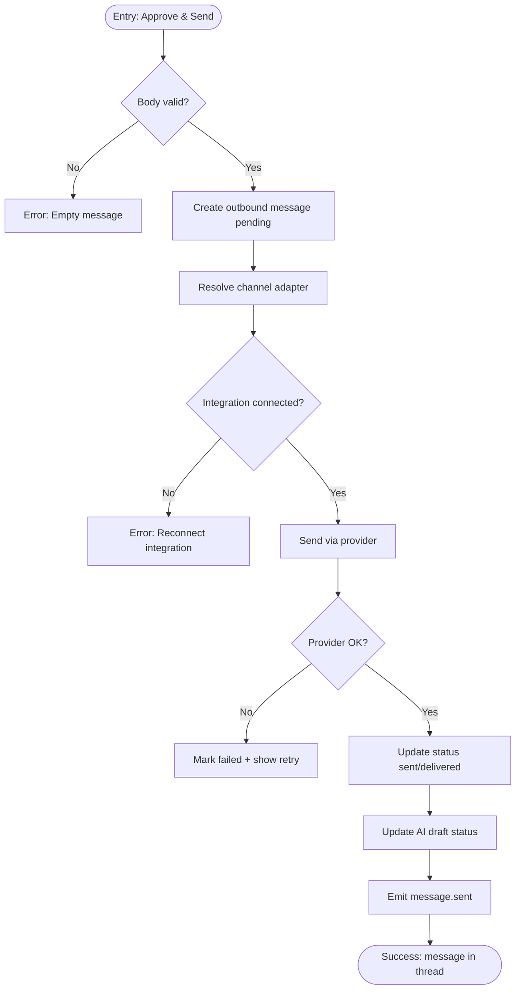

---

## 8. Receiving Replies

### 8.1 Inbound Message (Real-time)

| Aspect | Description |
|---|---|
| **Entry point** | Lead replies on WhatsApp, email, or chat widget |
| **User actions** | *(Passive)* may be viewing inbox or elsewhere |
| **System actions** | Webhook/sync receives message → idempotency check → attach to conversation → increment unread → update previews → notify assigned agent → emit `message.received` → realtime push to inbox |
| **Success state** | New message visible in thread; conversation rises in inbox; notification badge updates |
| **Error states** | Duplicate webhook ignored; orphan message queued for manual linking (edge case) |

### 8.2 Agent Reads & Responds Loop

| Aspect | Description |
|---|---|
| **Entry point** | Notification click; inbox unread filter |
| **User actions** | Open conversation → read → optionally AI assist → send reply |
| **System actions** | Mark read; decrement unread; loop continues |
| **Success state** | Conversation progressing toward qualification/booking |
| **Error states** | Stale thread data → refresh; assignment conflict if two agents reply (last write wins + activity log) |

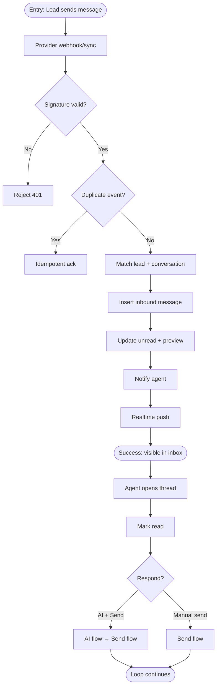

---

## 9. Analytics

### 9.1 View Analytics Overview

| Aspect | Description |
|---|---|
| **Entry point** | Sidebar **Analytics** → `/analytics` |
| **User actions** | Select date range; filter by channel/source; export CSV |
| **System actions** | Query aggregates + drill-down tables; enforce role (Viewer+ read) |
| **Success state** | Charts/tables show leads by source, response time, funnel conversion, AI assist rate |
| **Error states** | Insufficient data → empty charts with guidance; export too large → paginated download |

### 9.2 Drill-down from Dashboard KPI

| Aspect | Description |
|---|---|
| **Entry point** | Click KPI card on Dashboard (e.g. **New Leads**) |
| **User actions** | Review pre-filtered list |
| **System actions** | Navigate to Leads or Analytics with query params applied |
| **Success state** | Consistent numbers between dashboard and detail view |
| **Error states** | Stale cache → refresh indicator |

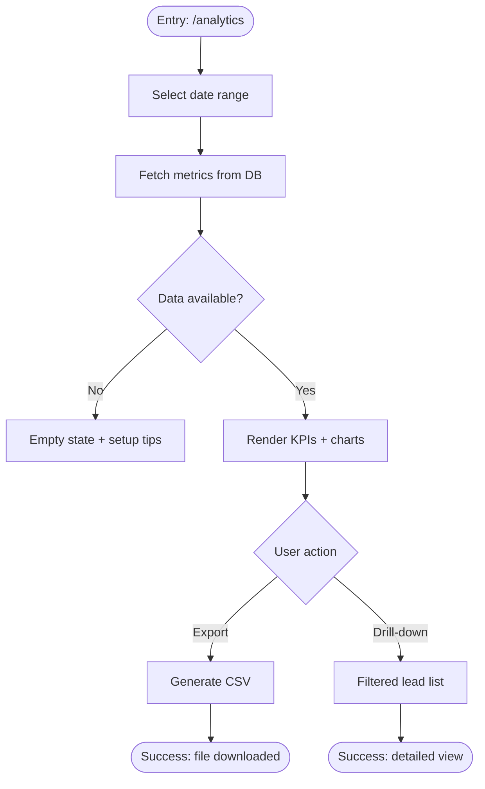

---

## 10. Settings

### 10.1 General Organization Settings

| Aspect | Description |
|---|---|
| **Entry point** | Sidebar **Settings** → General |
| **User actions** | Edit company name, timezone, language → **Save** |
| **System actions** | Validate; update org record; log settings change |
| **Success state** | Confirmation toast; dashboard dates/timezone reflect change |
| **Error states** | Validation error; permission denied for non-admin |

### 10.2 Connect WhatsApp Integration

| Aspect | Description |
|---|---|
| **Entry point** | Settings → Integrations → WhatsApp |
| **User actions** | Choose provider → enter credentials / OAuth → **Test Connection** → **Save** |
| **System actions** | Encrypt credentials server-side; register webhook; health check; log `integration.connected` |
| **Success state** | Status **Connected**; test message succeeds |
| **Error states** | Invalid credentials; webhook registration failed; provider unreachable |

### 10.3 AI Configuration

| Aspect | Description |
|---|---|
| **Entry point** | Settings → AI Configuration |
| **User actions** | Set tone, do/don't rules, FAQ snippets; toggle human-in-the-loop |
| **System actions** | Persist to org `ai_settings`; apply to future drafts |
| **Success state** | Saved; next AI draft reflects tone/rules |
| **Error states** | Snippet too long; save failure |

### 10.4 Automations / n8n Webhook

| Aspect | Description |
|---|---|
| **Entry point** | Settings → Automations |
| **User actions** | Add webhook URL → select events → **Enable** |
| **System actions** | Generate signing secret (show once); store hash; validate URL HTTPS |
| **Success state** | Automation active; test event delivers to n8n |
| **Error states** | Invalid URL; delivery failures shown in log |

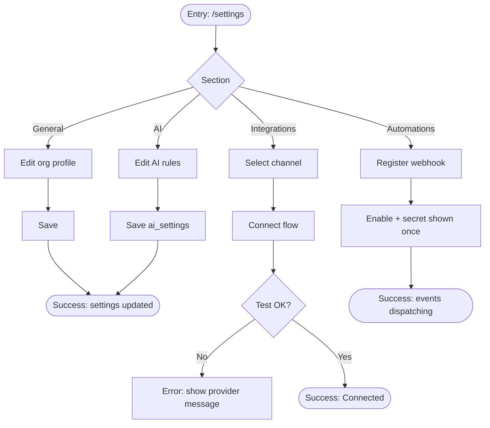

---

## 11. Master Journey: Login → AI Reply Sent

End-to-end happy path combining all flows.

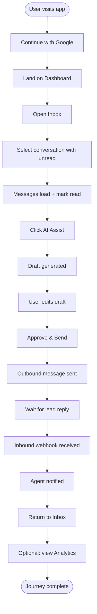

| Step | User action | System action | Success | Error |
|---|---|---|---|---|
| 1 | Sign in with Google | Provision session + org | Dashboard loads | OAuth fail |
| 2 | Open Inbox | List conversations by recency | Threads visible | Empty inbox state |
| 3 | Select thread | Load messages, mark read | Thread displayed | Not found / forbidden |
| 4 | Generate AI draft | AI + save draft | Draft shown | AI down / rate limit |
| 5 | Edit draft | Local validation | Ready to send | Over char limit |
| 6 | Send | Provider adapter outbound | Message sent | Integration error |
| 7 | Lead replies | Inbound normalized | New message + notify | Duplicate ignored |
| 8 | View analytics | Aggregate queries | Metrics accurate | Partial load |

---

## 12. Cross-Cutting Error Patterns

| Pattern | User experience | System behavior |
|---|---|---|
| **Unauthorized** | Redirect to sign-in | 401, no data leak |
| **Forbidden** | Inline "You don't have permission" | 403, audit log |
| **Not found** | "Resource not found" | 404, tenant-scoped query |
| **Rate limited** | "Too many requests, try again" | 429 with Retry-After |
| **Provider outage** | Action-specific fallback message | Circuit breaker, retry queue |
| **Network error** | Retry button | Client retry with backoff |

---

## 13. Role-Based Journey Differences

| Flow | Owner/Admin | Manager | Sales | Support | Viewer |
|---|---|---|---|---|---|
| Dashboard | Full | Full | Full | Limited | Read-only |
| Create lead | ✓ | ✓ | ✓ | ✗ | ✗ |
| Send message | ✓ | ✓ | ✓ | ✓ | ✗ |
| AI generate | ✓ | ✓ | ✓ | ✓ | ✗ |
| Integrations | ✓ | ✗ | ✗ | ✗ | ✗ |
| Automations | ✓ | ✗ | ✗ | ✗ | ✗ |
| Analytics | ✓ | ✓ | ✓ | Limited | ✓ |

---

*End of User Journey Specification — Project Atlas AI v1.0*
